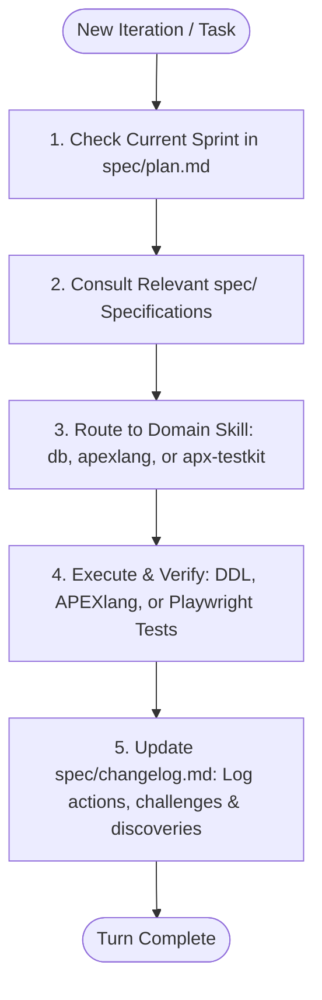

# Agent Operating Manual & Skill Routing Guide (AGENTS.md)

This document is the **primary contract for AI agents** working on the WorshipFlow codebase. **Every iteration must consult this file** to determine which specialized skill to activate and which specification documents in `spec/` to read before generating code or executing tasks.

---

## 1. Iteration Lifecycle Protocol

On **every development iteration**, the agent must execute the following sequential workflow:



1. **Locate Objective**: Read [`spec/plan.md`](file:///home/davi/Dev/apex-gemini/spec/plan.md) to understand current sprint goals and exit criteria.
2. **Consult Authority**: Read authoritative domain models in [`spec/schema.md`](file:///home/davi/Dev/apex-gemini/spec/schema.md), [`spec/spec.md`](file:///home/davi/Dev/apex-gemini/spec/spec.md), and [`spec/patterns.md`](file:///home/davi/Dev/apex-gemini/spec/patterns.md). Never infer schema, table names, or constraints from prompts alone.
3. **Route Skill**: Activate the exact skill needed for the task (see Routing Matrix in Section 2).
4. **Implement with Mandatory Prefixes**: Enforce the project **`WS_`** prefix on all database objects and PL/SQL units.
5. **Record Progress**: Update [`spec/changelog.md`](file:///home/davi/Dev/apex-gemini/spec/changelog.md) at the end of the iteration.

---

## 2. Skill Routing Matrix: When to Use Each Skill

| Specialized Skill | When to Use | Key Tools & References | Forbidden / Out of Scope |
| :--- | :--- | :--- | :--- |
| **`db`**<br>*(Oracle Database)* | • Writing, modifying, or reviewing DDL tables, constraints, sequences, triggers, and indexes.<br>• Implementing PL/SQL packages (`WS_PKG_SCHEDULER`, `WS_PKG_SERVICE_MGMT`, `WS_PKG_MUSICIAN_PORTAL`).<br>• Writing complex SQL queries, analytical views (`WS_V_ROSTER_CONFLICTS`), or batch algorithms.<br>• Performance tuning, explain plans, row locking (`FOR UPDATE`), and concurrency control.<br>• SQLcl execution, seed data population, and schema migration scripts. | • `spec/schema.md`<br>• `spec/patterns.md`<br>• MCP: `oracle-sqlcl` (`sql_run`, `sqlcl_run`) | • Do not use for APEX UI page authoring or client-side JavaScript. |
| **`apex` / `apexlang`**<br>*(Oracle APEX & APEXlang)* | • Generating or editing declarative APEXlang (`.apx`) components in `teste/` (or target app).<br>• Creating APEX pages (`p00001-home.apx`, modals, drawers, cards, interactive reports/grids).<br>• Configuring Shared Components (LOVs, navigation lists, breadcrumbs, authorizations, themes).<br>• Applying Universal Theme (Theme 42) template options, CSS utility classes, and custom tokens.<br>• Validating `.apx` syntax using `apexctl.mjs`. | • `teste/`<br>• `spec/patterns.md`<br>• `node tools/apexctl.mjs`<br>• `CUSTOMIZING_UNIVERSAL_THEME_LOWCODE_AND_APEXLANG.md` | • Do not write multi-table business DML directly in page processes; invoke PL/SQL package APIs instead. |
| **`apx-testkit`**<br>*(Playwright E2E Testing)* | • Synthesizing typed Page Object Models (POM) from `.apx` files.<br>• Writing and running deterministic Playwright end-to-end tests in `tests/e2e/`.<br>• Verifying user flows: musician 1-click invitation responses, blockout registration, leader matrix scheduling.<br>• Testing Universal Theme UI elements (dark/light toggle, cards, drawer dialogs, buttons).<br>• Analyzing test coverage and generating flow maps. | • `tests/e2e/`<br>• `@apx/testkit`<br>• `@apx/generator` | • Do not use for testing raw PL/SQL logic independently of the APEX UI (use SQLcl scripts for database unit tests). |
| **`oracle-sqlcl`**<br>*(MCP Server)* | • Live database inspection: querying `USER_TABLES`, `USER_CONSTRAINTS`, `USER_ERRORS`.<br>• Running DDL migration files (`01_tables_and_indexes.sql`, `02_seed_data.sql`).<br>• Testing packaged procedures directly via anonymous PL/SQL blocks. | • MCP tools: `sql_run`, `sqlcl_run`, `schema_information` | • Never run destructive DDL/DML (`DROP TABLE`, `TRUNCATE`) without explicit confirmation. |
| **`generative_ui`**<br>*(Visual UI Artifacts)* | • Presenting interactive charts, workflow diagrams, or clickable prototypes directly in the chat.<br>• Illustrating UI proposals before committing them to `.apx` files. | • Standalone HTML/CSS/JS artifacts | • Artifacts are for human feedback and do not substitute for actual `.apx` application code. |

---

## 3. Specification Routing: When to Look for `spec/` Documents

All project specifications are located **strictly inside [`spec/`](file:///home/davi/Dev/apex-gemini/spec/)**. No duplicate specification or plan files may exist in the repository root.

```text
spec/
├── spec.md         # Domain Context, User Personas, Edge Cases & Operational Lifecycle
├── schema.md       # ERD, 12 DDL Tables, Constraints, Indexes, Views & Package Specs
├── patterns.md     # PL/SQL Coding Standards, Naming Conventions, APEX UI/UX Patterns
├── plan.md         # 6-Sprint Development Roadmap & Exit Criteria
└── changelog.md    # Activity Journal, Challenges Solved & Architectural Discoveries
```

### Detailed Document Lookup Guide

#### 1. Consult [`spec/spec.md`](file:///home/davi/Dev/apex-gemini/spec/spec.md) When:
* Clarifying business rules (e.g. volunteer fatigue caps: `max_services_month`).
* Reviewing role permissions: `LEADER` (full control), `MUSICIAN` (self-service & responses), `TECH` (read-only stage layout).
* Implementing the operational lifecycle (Template $\rightarrow$ Service $\rightarrow$ Roster $\rightarrow$ Publish $\rightarrow$ Invitations $\rightarrow$ Confirm/Decline $\rightarrow$ Replacement).
* Handling concurrency edge cases:
  - *Retroactive Blockouts*: Musician blocks out after being scheduled.
  - *Double-Booking*: Musician assigned to multiple slots on the same date.
  - *Stale Invitations*: Optimistic locking token mismatch (`row_version_number`).

#### 2. Consult [`spec/schema.md`](file:///home/davi/Dev/apex-gemini/spec/schema.md) When:
* Creating or modifying database tables, columns, data types, nullability, or default values.
* Checking constraint names and definitions:
  - Primary Keys: `PK_WS_<TABLE>`
  - Foreign Keys: `FK_WS_<TABLE>_<TARGET>`
  - Unique Constraints: `UQ_WS_<TABLE>_<COLS>`
  - Check Constraints: `CK_WS_<TABLE>_<NAME>` (e.g. musical key checks in `WS_SONGS`)
* Creating or tuning indexes (`IDX_WS_<TABLE>_<COLS>`).
* Reviewing or querying view definitions ([`WS_V_ROSTER_CONFLICTS`](file:///home/davi/Dev/apex-gemini/spec/schema.md#L350)).
* Implementing or updating PL/SQL package prototypes:
  - [`WS_PKG_SCHEDULER`](file:///home/davi/Dev/apex-gemini/spec/schema.md#L380): `apply_template`, `auto_assign_roster`.
  - Schema-level wrappers: [`WS_PRC_APPLY_TEMPLATE`](file:///home/davi/Dev/apex-gemini/spec/schema.md#L496), [`WS_PRC_AUTO_ASSIGN_ROSTER`](file:///home/davi/Dev/apex-gemini/spec/schema.md#L508).

#### 3. Consult [`spec/patterns.md`](file:///home/davi/Dev/apex-gemini/spec/patterns.md) When:
* Writing PL/SQL to adhere to naming conventions:
  - Parameters: `p_` (in), `p_out_` / `x_` (out), `pio_` (in/out).
  - Local variables: `v_`, Constants: `c_`, Records: `r_`, Types: `t_`.
* Checking transaction rules:
  - No `COMMIT` / `ROLLBACK` in helper procedures (commit only at process/API boundary).
  - Row locking: `SELECT ... FOR UPDATE` on `WS_SERVICES` before auto-scheduling.
  - Error logging: `apex_error.add_error` and `apex_debug.error`.
* Structuring APEX UI components:
  - Mobile Musician Portal: Cards region with Green Accept & Red Decline buttons, Drawer modal for decline reason.
  - Leader Matrix: Interactive Grid with status badging (`PENDING`, `ACCEPTED`, `DECLINED`, `CONFLICT`), smart LOV query flagging unavailable musicians.

#### 4. Consult [`spec/plan.md`](file:///home/davi/Dev/apex-gemini/spec/plan.md) When:
* Starting any work iteration to verify sprint sequence:
  - **Sprint 0**: DB Foundation & DDL (`01_tables_and_indexes.sql`, `02_seed_data.sql`).
  - **Sprint 1**: PL/SQL Business API Packages (`WS_PKG_SCHEDULER`, `WS_PKG_SERVICE_MGMT`, `WS_PKG_MUSICIAN_PORTAL`).
  - **Sprint 2**: Musician Mobile Portal (`/musician`, Cards, Decline Drawer, Blockouts).
  - **Sprint 3**: Leader Scheduling Matrix (`/leader`, Matrix Grid, Smart LOV, Conflict badges).
  - **Sprint 4**: Song Repertoire & Setlist Builder (`/songs`, YouTube modal, Transposition keys).
  - **Sprint 5**: Security, APEX Authorization (`WS_AUTH_LEADER`, `WS_AUTH_MUSICIAN`), Concurrency & Playwright UAT.

#### 5. Consult & Update [`spec/changelog.md`](file:///home/davi/Dev/apex-gemini/spec/changelog.md) When:
* **Logging Iteration Outputs**: After completing any sprint task, add a new entry to Section 1 (Activity Log).
* **Documenting Challenges**: Record any non-trivial technical obstacle, edge case, or bug along with the resolution in Section 2.
* **Preserving Discoveries**: Note architectural patterns or performance insights in Section 3.

---

## 4. Universal Invariants (Non-Negotiable Rules)

1. **Prefix Invariant**: Every database object (table, view, package, standalone procedure, function, trigger, sequence, constraint, index) MUST use the **`WS_`** / `ws_` prefix.
2. **Single Source of Truth**: All documentation, architecture specs, and sprint plans reside exclusively in `spec/`. Do not create `.md` files at root other than this `AGENTS.md` and repo-level research docs.
3. **Offline Context over Guessing**: Never hallucinate database column names or APEX component properties. Query compiler truth or inspect `spec/schema.md`.
4. **Autonomous Transactions**: `PRAGMA AUTONOMOUS_TRANSACTION` is strictly reserved for error/audit logging.
5. **Security First**: Always bind `:APP_USER` and check authorization schemes (`WS_AUTH_LEADER`, `WS_AUTH_MUSICIAN`). Never concatenate variables into dynamic SQL.
