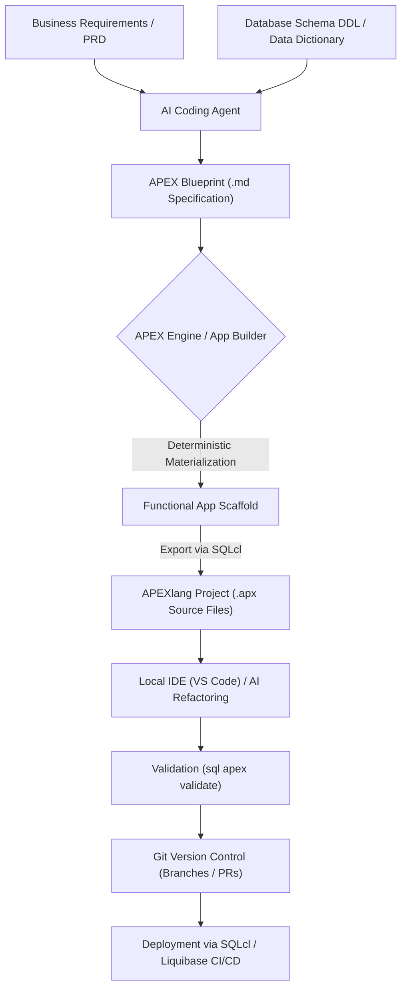
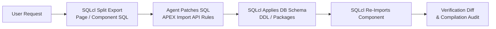
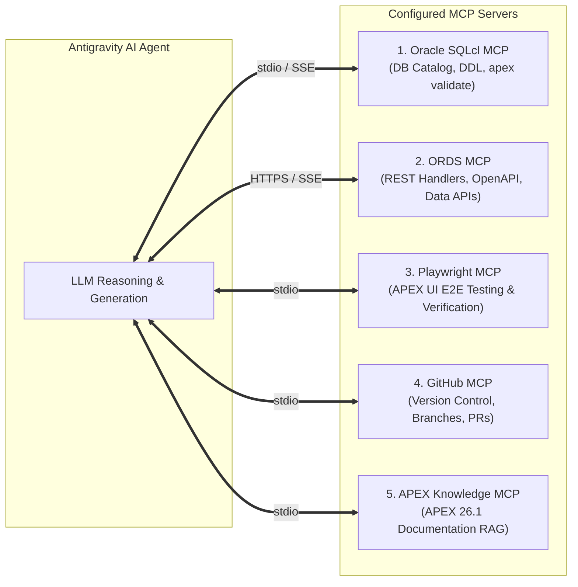

# Comprehensive Research: Oracle APEX, APEXlang, Spec-Driven Development, Skills & MCP Architecture

---

## Table of Contents
1. [Section 1: Spec-Driven Development (SDD) with APEXlang](#section-1-spec-driven-development-sdd-with-apexlang)
   - [1.1 Background & The Architectural Paradigm Shift](#11-background--the-architectural-paradigm-shift)
   - [1.2 What is APEXlang?](#12-what-is-apexlang)
   - [1.3 The Dual-Tier Architecture: Blueprint vs. APEXlang](#13-the-dual-tier-architecture-blueprint-vs-apexlang)
   - [1.4 The Spec-Driven Development (SDD) Lifecycle](#14-the-spec-driven-development-sdd-lifecycle)
   - [1.5 File Format, Directory Layout, and Syntax Nuances](#15-file-format-directory-layout-and-syntax-nuances)
   - [1.6 Tooling Ecosystem: SQLcl & VS Code Integration](#16-tooling-ecosystem-sqlcl--vs-code-integration)
   - [1.7 DevOps, Git Version Control, and CI/CD Impact](#17-devops-git-version-control-and-cicd-impact)
2. [Section 2: Possibilities of Developing Without Using Skills (Native Capabilities)](#section-2-possibilities-of-developing-without-using-skills-native-capabilities)
   - [2.1 Backend Database & Schema Engineering](#21-backend-database--schema-engineering)
   - [2.2 APEX Server-Side PL/SQL APIs](#22-apex-server-side-plsql-apis)
   - [2.3 Client-Side JavaScript & Dynamic Actions APIs](#23-client-side-javascript--dynamic-actions-apis)
   - [2.4 Universal Theme (UT), CSS, and Layout Systems](#24-universal-theme-ut-css-and-layout-systems)
   - [2.5 Native APEXlang and Blueprint Authoring](#25-native-apexlang-and-blueprint-authoring)
   - [2.6 CLI & Environment Automation via Bash](#26-cli--environment-automation-via-bash)
   - [2.7 Inherent Limitations of the Native Agent](#27-inherent-limitations-of-the-native-agent)
3. [Section 3: Official and Community Oracle APEX Skills Ecosystem](#section-3-official-and-community-oracle-apex-skills-ecosystem)
   - [3.1 Overview of the Agentic Skill Ecosystem](#31-overview-of-the-agentic-skill-ecosystem)
   - [3.2 Official Oracle Skills: `oracle/skills`](#32-official-oracle-skills-oracleskills)
   - [3.3 Deep Dive: The Official Oracle `apexlang` Skill & Toolchain (`apexctl.mjs`)](#33-deep-dive-the-official-oracle-apexlang-skill--toolchain-apexctlmjs)
   - [3.4 Top Community Skill 1: `avhrst/apex-component-modifier`](#34-top-community-skill-1-avhrstapex-component-modifier)
   - [3.5 Top Community Skill 2: `andre-simplifica/oracle-apex-ai-skills`](#35-top-community-skill-2-andre-simplificaoracle-apex-ai-skills)
   - [3.6 Top Community Skill 3: `United-Codes/uc-apx` & Developer Tooling](#36-top-community-skill-3-united-codesuc-apx--developer-tooling)
   - [3.7 Community Testing & Specialized Skills: `apx-testkit` & Modernization](#37-community-testing--specialized-skills-apx-testkit--modernization)
   - [3.8 Comparative Architectural Matrix](#38-comparative-architectural-matrix)
   - [3.9 Workspace Installation & Configuration Guide](#39-workspace-installation--configuration-guide)
4. [Section 4: Model Context Protocol (MCP) Connections to Use](#section-4-model-context-protocol-mcp-connections-to-use)
   - [4.1 Why MCP is Critical for Oracle APEX Development](#41-why-mcp-is-critical-for-oracle-apex-development)
   - [4.2 Connection 1: Oracle SQLcl / DB Tools MCP Server](#42-connection-1-oracle-sqlcl--db-tools-mcp-server)
   - [4.3 Connection 2: Oracle REST Data Services (ORDS) MCP Server](#43-connection-2-oracle-rest-data-services-ords-mcp-server)
   - [4.4 Connection 3: Playwright / Browser Automation MCP Server](#44-connection-3-playwright--browser-automation-mcp-server)
   - [4.5 Connection 4: Git / GitHub MCP Server](#45-connection-4-git--github-mcp-server)
   - [4.6 Connection 5: Documentation & Vector RAG MCP Server](#46-connection-5-documentation--vector-rag-mcp-server)
   - [4.7 Production-Ready `mcp_config.json` Configuration](#47-production-ready-mcp_configjson-configuration)
5. [Section 5: Architectural Summary & Action Plan](#section-5-architectural-summary--action-plan)

---

# Section 1: Spec-Driven Development (SDD) with APEXlang

## 1.1 Background & The Architectural Paradigm Shift

For more than two decades (from HTML DB through APEX 24.x), Oracle APEX was fundamentally a **browser-first, metadata-driven low-code platform**. Applications were constructed by pointing and clicking within the APEX App Builder (Page Designer). Under the hood, application definitions were stored inside database tables (in the APEX engine metadata schemas like `APEX_240100`) and exported as monolithic, opaque SQL scripts:
- **Surrogate Numeric Identifiers**: Every region, item, button, validation, and dynamic action was assigned an internal numeric ID (`wwv_flow_api.create_page_plug`, `wwv_flow_api.create_page_item`).
- **Unreadable Diff Diffs**: Moving a single button or renaming an item modified thousands of lines of SQL, changing internal sequence values and timestamps.
- **Merge Conflicts**: Concurrent feature development across team members frequently led to corrupted export files, forcing teams to rely on complex page-locking mechanisms or manual merge reconciliation.
- **Friction with Modern AI Agents**: Large Language Models (LLMs) struggled to generate or modify valid, bug-free APEX SQL exports because `wwv_flow_api` is private, proprietary, verbose, and heavily interdependent on internal sequence IDs.

Introduced in **Oracle APEX 26.1**, **APEXlang** and **Spec-Driven Development (SDD)** fundamentally change this model. APEX applications can now be treated like modern software projects: written in declarative, human-readable text, tracked in standard Git repositories, scaffolded from high-level specifications, and edited directly in local IDEs like VS Code.

```
+---------------------------------------------------------------------------------------+
|                                Traditional APEX Workflow                              |
| Requirements -> App Builder (Browser UI) -> Monolithic SQL Export -> Difficult Diffs  |
+---------------------------------------------------------------------------------------+
                                           vs.
+---------------------------------------------------------------------------------------+
|                           Spec-Driven Development (APEX 26.1+)                         |
| Requirements + Schema -> Blueprint (.md) -> Deterministic Scaffold -> APEXlang (.apx) |
|           -> Local VS Code / SQLcl -> Clean Git Diffs & PRs -> CI/CD Pipeline          |
+---------------------------------------------------------------------------------------+
```

---

## 1.2 What is APEXlang?

**APEXlang** is an **open, declarative, human-readable application definition language** designed specifically for Oracle APEX. 

Key attributes of APEXlang:
- **Text-Based Source Code**: Replaces opaque PL/SQL calls with clean, declarative syntax (`.apx` files) mirroring the mental model of an APEX developer.
- **Component Modularity**: Applications are broken down into logical components (individual pages, shared components, application settings) stored in dedicated files.
- **AI-Optimized Grammar**: Built from the ground up with structured, predictable syntax so LLMs can reliably parse, generate, refactor, and review application definitions.
- **Embedded Code Support**: Directly embeds standard programming languages (`sql`, `plsql`, `javascript-browser`, `css`, `html`) within fenced code blocks.
- **Two-Way Roundtripping**: Applications can be exported from APEX into APEXlang, edited locally, validated, and re-imported into APEX without losing component fidelity.

---

## 1.3 The Dual-Tier Architecture: Blueprint vs. APEXlang

Oracle APEX's Spec-Driven Development architecture separates the development lifecycle into two distinct tiers:

| Attribute | Tier 1: APEX Blueprint | Tier 2: APEXlang (`.apx`) |
| :--- | :--- | :--- |
| **File Format** | Markdown (`.md`) | Structured Text (`.apx`) |
| **Abstraction Level** | High-level architectural intent | Fine-grained component source code |
| **Primary Target** | Application scaffolding & contract | Long-term source control & code editing |
| **Contents** | App metadata, navigation, page list, data entities, report/form archetypes, user roles | Every region, page item, button, dynamic action, computation, process, and validation |
| **Role in Workflow** | The starting "contract" generated by the AI agent from functional specs | The granular, version-controlled source code maintained across sprints |
| **Determinism** | Consumed by APEX engine to deterministically build the initial application scaffold | Parsed, validated, and compiled into APEX database metadata |

---

## 1.4 The Spec-Driven Development (SDD) Lifecycle

Spec-Driven Development establishes a structured, repeatable development loop:



1. **Step 1: Specification & Schema Inputs**: The developer or product team defines the functional intent (user personas, required screens, business rules) and provides database schema metadata (tables, columns, primary/foreign keys).
2. **Step 2: Blueprint Generation**: The AI agent synthesizes these inputs into an **APEX Blueprint** (a structured Markdown contract).
3. **Step 3: Deterministic Materialization**: The APEX runtime engine consumes the Blueprint and deterministically generates the working application structure (menus, interactive reports, modal forms, cards). Because the engine does the materialization, the resulting application is guaranteed to adhere to APEX standards.
4. **Step 4: Granular APEXlang Decomposition**: The application is exported as a package of `.apx` files.
5. **Step 5: Code Editing & Refinement**: Developers and AI agents write business logic, refine page layouts, and inject custom PL/SQL/JavaScript directly in `.apx` files.
6. **Step 6: Local Validation**: The code is validated locally using SQLcl (`apex validate`) prior to committing.
7. **Step 7: Version Control & CI/CD**: Changes are pushed to Git, reviewed via standard pull requests, and deployed automatically through CI/CD pipelines.

---

## 1.5 File Format, Directory Layout, and Syntax Nuances

When an application is exported using APEXlang, it decomposes into a clean, intuitive directory structure:

### Directory Layout
```text
my-apex-app/
├── .apex/
│   └── apexlang.json              # Versioning, schema mapping, and application settings
├── application.apx                # Global settings, auth schemes, navigation, theme styles
├── pages/
│   ├── p00001-home.apx            # Dashboard cards and KPIs
│   ├── p00002-departments.apx     # Interactive Grid for Department administration
│   ├── p00003-employees.apx       # Faceted search and report
│   └── p00004-emp-form.apx        # Modal dialog form with dynamic actions
└── shared-components/
    ├── lists/
    │   └── desktop-navigation.apx
    ├── lovs/
    │   └── departments-lov.apx
    └── security/
        └── admin-only-scheme.apx
```

### Syntax Breakdown

#### 1. Page Definition Example (`pages/p00003-employees.apx`)
```text
page 3 (
    title: "Employee Management",
    alias: "employees",
    pageGroup: "Administration",
    autocomplete: false,
    
    region search_filters (
        type: staticContent,
        title: "Filters",
        gridColumn: 1,
        gridSpan: 12,
        
        item P3_DEPTNO (
            type: selectList,
            label: "Department",
            lov: "LOV_DEPARTMENTS",
            displayExtraValues: false,
            nullOption: true,
            nullValueLabel: "- All Departments -"
        ),
        
        item P3_SEARCH (
            type: text,
            label: "Search Name or Job",
            placeholder: "Type to search..."
        )
    ),
    
    region employee_report (
        type: interactiveReport,
        title: "Employees Directory",
        gridColumn: 1,
        gridSpan: 12,
        sourceQuery: ```sql
            SELECT empno,
                   ename,
                   job,
                   mgr,
                   hiredate,
                   sal,
                   comm,
                   deptno
              FROM emp
             WHERE (:P3_DEPTNO IS NULL OR deptno = :P3_DEPTNO)
               AND (:P3_SEARCH IS NULL OR 
                    UPPER(ename) LIKE '%' || UPPER(:P3_SEARCH) || '%' OR 
                    UPPER(job) LIKE '%' || UPPER(:P3_SEARCH) || '%')
        ```,
        pageItemsToSubmit: [ P3_DEPTNO P3_SEARCH ],
        staticId: "emp-report"
    )
)
```

#### 2. Modal Form & Dynamic Action Example (`pages/p00004-emp-form.apx`)
```text
page 4 (
    title: "Employee Details",
    pageMode: modalDialog,
    dialogWidth: "720px",
    
    region emp_form (
        type: form,
        title: "Employee Information",
        tableName: "EMP",
        primaryKeyColumn: "EMPNO",
        
        item P4_EMPNO (
            type: hidden,
            primaryKey: true
        ),
        
        item P4_ENAME (
            type: text,
            label: "Full Name",
            required: true
        ),
        
        item P4_SAL (
            type: number,
            label: "Salary",
            formatMask: "FML999G999G990D00"
        ),
        
        item P4_COMM (
            type: number,
            label: "Commission"
        )
    ),
    
    dynamicAction recalculate_total (
        event: change,
        triggerItems: [ P4_SAL P4_COMM ],
        action execute_javascript (
            code: ```javascript-browser
                const sal = Number(apex.item("P4_SAL").getValue()) || 0;
                const comm = Number(apex.item("P4_COMM").getValue()) || 0;
                const total = sal + comm;
                apex.message.showPageSuccess("Total Compensation: " + total.toFixed(2));
            ```
        )
    )
)
```

### Key Language Features & Rules
- **Block Enclosure**: Blocks use parentheses `( ... )` instead of curly braces.
- **Embedded Code Fences**: Three backticks plus language identifier (```sql, ```plsql, ```javascript-browser, ```css, ```html).
- **Array Syntax**: Elements enclosed in square brackets and space-separated: `[ P3_DEPTNO P3_SEARCH ]`.
- **Substitution Tokens**: Native support for APEX session tokens (`#APP_FILES#`, `#APP_IMAGES#`, `&APP_USER.`).

---

## 1.6 Tooling Ecosystem: SQLcl & VS Code Integration

APEXlang is natively supported across the Oracle Database toolchain:

### 1. Oracle SQLcl Commands
Starting with APEX 26.1 support in SQLcl, developers interact with APEXlang via the `apex` command group:

```sql
-- Connect to the target schema in SQLcl
sql my_dev_user/mypassword@db_service

-- 1. Export application into human-readable APEXlang format
SQL> apex export -applicationid 100 -exptype apexlang -dir ./src

-- 2. Validate APEXlang source files locally before committing or deploying
SQL> apex validate -input ./src

-- 3. Import APEXlang directory or zip into the database
SQL> apex import -input ./src -applicationid 100
```

### 2. VS Code (Oracle SQL Developer Extension)
- **Syntax Highlighting & Autocomplete**: Recognizes `.apx` extensions, providing contextual code completion for APEX region types, item types, and attributes.
- **Live Diagnostics**: Validates APEXlang syntax on save, highlighting missing parent properties or malformed queries.
- **Sync with DB**: Pushes changes directly to a linked development database session.

---

## 1.7 DevOps, Git Version Control, and CI/CD Impact

The transition to APEXlang removes the final barrier separating APEX from standard enterprise DevOps:

| DevOps Practice | Traditional SQL Export | APEXlang (`.apx`) |
| :--- | :--- | :--- |
| **Git Diffs** | Tens of thousands of lines of changing internal IDs. | Line-by-line diff showing only changed items, queries, or properties. |
| **Branch Merging** | High risk of file corruption; manual conflict resolution is impractical. | Standard Git three-way merge; distinct pages live in separate files. |
| **Pull Requests** | PR reviews are nearly impossible due to file size and obscurity. | Meaningful peer reviews: reviewers inspect actual SQL, layout, and logic changes. |
| **Automated Testing** | Requires importing the full SQL script into a disposable schema to detect errors. | Fast `apex validate` step in CI/CD pipelines before database deployment. |
| **CI/CD Deployment** | Monolithic reinstall; slow compilation. | Fast incremental deployment or clean scripted deployment via SQLcl. |

---

# Section 2: Possibilities of Developing Without Using Skills (Native Capabilities)

An advanced AI coding assistant (such as Antigravity / Gemini) possesses extensive out-of-the-box knowledge and capabilities for Oracle APEX development even without custom skills.

```
+-----------------------------------------------------------------------------------------+
|                         Native AI Assistant Capabilities                                |
+-----------------------------------------------------------------------------------------+
| 1. SQL & Advanced PL/SQL Engine (Packages, Triggers, Views, Analytical Queries)         |
| 2. APEX PL/SQL Server APIs (APEX_UTIL, APEX_EXEC, APEX_COLLECTION, APEX_JSON)           |
| 3. Client-Side JavaScript APIs (apex.item, apex.server.process, apex.message)           |
| 4. Universal Theme & CSS Framework (Responsive Classes, UT Modifier Tokens)            |
| 5. Quick SQL Shorthand Generation (Instant Database Data Models)                        |
| 6. Declarative APEXlang (.apx) Generation and Semantic Diffing                          |
| 7. Local Terminal Execution (SQLcl, Git, Curl, Bash Scripting via run_command)          |
+-----------------------------------------------------------------------------------------+
```

## 2.1 Backend Database & Schema Engineering

Without any skills, the model can generate production-grade database backend code:
- **Relational DDL**: Defining tables, primary keys, compound foreign keys, check constraints, default expressions, and virtual columns.
- **PL/SQL Architecture**: Writing modular, enterprise-grade package specifications (`.pks`) and bodies (`.pkb`) following the **"Smart Database"** paradigm—ensuring complex transaction logic lives in database packages rather than scattered across APEX page processes.
- **Advanced Querying**: Writing high-performance SQL using analytical functions (`ROW_NUMBER()`, `DENSE_RANK()`, `LEAD()`, `LAG()`, `LISTAGG() WITHIN GROUP`, `MODEL` clauses, and Common Table Expressions / recursive `WITH`).
- **Quick SQL**: Generating Quick SQL shorthand notation to rapidly draft schemas, audit columns, sample data, and foreign key relationships.

---

## 2.2 APEX Server-Side PL/SQL APIs

The agent has native mastery of the full suite of APEX PL/SQL packages:

1. **`APEX_EXEC`**:
   - Programmatically executing SQL queries, PL/SQL blocks, and REST Data Sources without hardcoding database connections.
   ```sql
   apex_exec.execute_remote_rest_service(
       p_static_id => 'EMPLOYEES_REST_SOURCE',
       p_operation => 'GET'
   );
   ```
2. **`APEX_COLLECTION`**:
   - Creating, populating, and manipulating session-scoped temporary data tables for multi-step wizards, shopping carts, or bulk uploads.
   ```sql
   apex_collection.create_or_truncate_collection(p_collection_name => 'CART');
   apex_collection.add_member(
       p_collection_name => 'CART',
       p_c001            => :P1_PRODUCT_ID,
       p_n001            => :P1_QUANTITY
   );
   ```
3. **`APEX_UTIL`**:
   - Manipulating session state, clearing page cache (`apex_util.clear_page_cache(2)`), managing workspace user roles, and setting session timeouts.
4. **`APEX_JSON`**:
   - Generating and parsing complex, nested JSON payloads for REST APIs and AJAX endpoints.
5. **`APEX_WEB_SERVICE`**:
   - Executing SOAP and RESTful web service requests with custom HTTP headers, basic auth, bearer tokens, and multipart form-data.
6. **`APEX_MAIL`**:
   - Enqueueing emails with HTML templates, dynamic substitution tags, and file attachments from database BLOBs.
7. **`APEX_SESSION`**:
   - Attaching to, creating, or destroying APEX sessions in background DBMS_SCHEDULER jobs.

---

## 2.3 Client-Side JavaScript & Dynamic Actions APIs

The agent natively understands the client-side JavaScript architecture of Oracle APEX:
- **Item Manipulation**:
  ```javascript
  // Read and set values
  const deptId = apex.item("P2_DEPTNO").getValue();
  apex.item("P2_SALARY").setValue(5000);
  
  // Visibility and state
  apex.item("P2_COMMISSION").show();
  apex.item("P2_COMMISSION").disable();
  ```
- **AJAX Communication with Database Processes**:
  ```javascript
  apex.server.process("CALCULATE_BONUS", {
      x01: apex.item("P2_EMPNO").getValue(),
      pageItems: "#P2_DEPTNO,#P2_SALARY"
  }, {
      dataType: "json",
      success: function(data) {
          apex.item("P2_BONUS").setValue(data.bonus);
          apex.message.showPageSuccess("Bonus calculated successfully.");
      },
      error: function(jqXHR, textStatus, errorThrown) {
          apex.message.showErrors([{
              type: "error",
              location: "page",
              message: "Calculation failed: " + errorThrown,
              unsafe: false
          }]);
      }
  });
  ```
- **Interactive Grid (IG) APIs**:
  - Interacting with the underlying model: `apex.region("emp-grid").widget().interactiveGrid("getViews", "grid").model`.

---

## 2.4 Universal Theme (UT), CSS, and Layout Systems

The agent understands Universal Theme (Theme 42) design tokens and CSS architecture:
- **Utility Classes**: `u-padding-A-0`, `u-margin-V-md`, `u-color-1-text`, `u-bold`.
- **Button Modifiers**: `t-Button--hot`, `t-Button--simple`, `t-Button--icon`, `t-Button--danger`.
- **Region & Card Templates**: `t-Card`, `t-Region--accent1`, `t-Region--scrollBody`, `t-Alert--info`.
- **Responsive Layout**: Utilizing the 12-column grid system (`col-12`, `col-md-6`, `col-lg-4`).

---

## 2.5 Native APEXlang and Blueprint Authoring

Even without skills, the LLM can:
- Author valid APEXlang `.apx` files for pages, regions, items, dynamic actions, and shared components.
- Generate high-level APEX Blueprint Markdown specifications from user-described business requirements.
- Review existing `.apx` files to identify syntax errors, missing properties, or invalid SQL queries.

---

## 2.6 CLI & Environment Automation via Bash

Through the native `run_command` tool, the agent can interact with the local development environment:
- Execute SQLcl commands (`sql -S user/pass@db @script.sql`).
- Execute Git workflows (`git status`, `git add`, `git commit`, `git checkout -b`).
- Package `.apx` directories into zip archives (`zip -r app.zip ./src`).
- Call external REST endpoints using `curl`.

---

## 2.7 Inherent Limitations of the Native Agent

Without specialized skills, the agent faces distinct challenges:

| Limitation | Impact on Development |
| :--- | :--- |
| **No Architectural Guardrails** | The agent may suggest placing business logic directly in APEX page processes instead of database packages. |
| **Blueprint Parser Drift** | Minor formatting deviations in the Blueprint Markdown might cause the APEX 26.1 Blueprint parser to throw errors. |
| **Context Blindness** | The agent does not know the live database schema (table names, column types, constraints) unless the user manually pastes them. |
| **Security Oversights** | Without an explicit security checklist, the agent might forget to enforce Session State Protection (SSP) or use unescaped string substitutions (`&ITEM!RAW.`). |
| **No Automated Runbook** | The agent does not automatically run validation commands (`apex validate`) after editing `.apx` files unless specifically instructed. |

---

# Section 3: Official and Community Oracle APEX Skills Ecosystem

## 3.1 Overview of the Agentic Skill Ecosystem

In modern AI coding assistants (such as Antigravity, Claude Code, and Codex), **Skills** are self-contained, version-controlled instruction packs that transform general-purpose Large Language Models into specialized domain engineers. Rather than relying on fuzzy prompts, skills enforce deterministic rules, EBNF grammars, CLI toolchains, and quality checklists through **progressive disclosure**—loading granular technical context only when relevant to the task.

In the Oracle APEX ecosystem, agent skills have matured rapidly on GitHub into two complementary tiers:
1. **Official Oracle Skills (`oracle/skills`)**: Authored and maintained directly by Oracle, providing authoritative EBNF grammar contracts, compiler-truth validation tools (`apexctl.mjs`, `query-valid-props.mjs`), and comprehensive database tooling (`sqlcl`, `ords`, `plsql`, `security`).
2. **High-Impact Community Skills**: Created by enterprise consultants and APEX veterans to address real-world workflows—such as component patching without Page Designer (`avhrst/apex-component-modifier`), multi-developer team locking (`andre-simplifica/oracle-apex-ai-skills`), commercial APEXlang scaffolding (`United-Codes/uc-apx`), and automated Playwright test generation (`satwikjambula/apx-testkit`).

```
+----------------------------------------------------------------------------------------------------+
|                                Oracle APEX Agent Skills Ecosystem                                  |
+----------------------------------------------------------------------------------------------------+
|  OFFICIAL ORACLE SKILLS (oracle/skills)            |  COMMUNITY SKILLS (GitHub)                    |
|  - apex/apexlang (EBNF Grammar & apexctl CLI)       |  - avhrst/apex-component-modifier (35 stars)  |
|  - db/sqlcl (Built-in MCP Server & Liquibase)      |  - andre-simplifica/oracle-apex-ai-skills     |
|  - db/ords (REST Modules & OAuth2)                 |  - United-Codes/uc-apx (Scaffolding Engine)   |
|  - db/plsql (Smart DB Architecture & Tuning)       |  - satwikjambula/apx-testkit (Playwright E2E) |
|  - db/security (Hardening & Session State)         |  - silviosotelo/oracle-forms-migration        |
+----------------------------------------------------------------------------------------------------+
```

---

## 3.2 Official Oracle Skills: `oracle/skills`

The primary, authoritative source of installable skills for Oracle technologies is the [**`oracle/skills`**](https://github.com/oracle/skills) repository. It provides developers, administrators, and AI agents with source-backed guidance across the Oracle ecosystem.

### Distribution & Installation
The repository is distributed as an npm package and a Claude Code / Antigravity plugin marketplace:

```bash
# 1. Install specific domains via npx
npx skills add oracle/skills/apex
npx skills add oracle/skills/db

# 2. Or register the repository as a plugin marketplace in Claude Code / Antigravity
/plugin marketplace add oracle/skills
/plugin install apex@oracle-skills
/plugin install db@oracle-skills
```

### Domain Architecture
The repository is split into domain directories, each providing targeted agent routing:

| Domain Directory | Scope & Focus | Key APEX Relevance |
| :--- | :--- | :--- |
| **`apex/`** | Oracle APEX application development and APEXlang | Contains the official `apexlang` compiler contracts, `apexctl.mjs` CLI, template components, and end-to-end application generation workflows. |
| **`db/sqlcl/`** | Oracle SQLcl CLI & Automation | Built-in SQLcl 25.2+ MCP server (`sql -mcp`), automated Liquibase changelogs, headless CI/CD, and DDL extraction. |
| **`db/ords/`** | Oracle REST Data Services | Designing RESTful modules, OAuth2 client credentials, metadata catalogs, and pre-authenticated requests. |
| **`db/plsql/`** | Oracle PL/SQL Engineering | Package-driven "Smart Database" architectures, bulk processing (`BULK COLLECT`, `FORALL`), and performance tuning. |
| **`db/security/`** | Oracle Database & APEX Security | Session state protection, privilege boundaries, virtual private database (VPD), and SQL injection defenses. |
| **`db/migrations/`** | Database Lifecycle Management | Automated Liquibase migrations, rollbacks, and schema synchronization. |
| **`db/vecdb/`** | AI Vector Search (23ai/26ai) | Vector embeddings, similarity searches, and hybrid AI queries in Oracle Database. |

---

## 3.3 Deep Dive: The Official Oracle `apexlang` Skill & Toolchain (`apexctl.mjs`)

The official `oracle/skills/apex/apexlang` skill is not merely a collection of prompt templates; it is an **industrial-grade agent engineering package** containing executable JavaScript utilities, formal grammars, and compiler-backed metadata.

### 1. Architectural Components

```text
apex/apexlang/
├── SKILL.md                          # Main routing contract and local context resolution
├── manifest.json                     # Complete index of grammar assets and validation rules
├── assets/
│   ├── grammar/apexlang.ebnf         # The formal EBNF syntax oracle for APEXlang
│   ├── rules.catalog.json            # Machine-readable compilation and design rules
│   ├── routing-catalog-main.json     # Fast lookup routing for components
│   └── validator-fix-recipes.json    # Deterministic repair recipes for known compiler errors
├── tools/
│   ├── apexctl.mjs                   # Main CLI tool for probing, scaffolding, formatting & validation
│   ├── query-valid-props.mjs         # Compiler-truth query tool for legal properties
│   └── compiler-truth-audit.mjs      # Pre-flight audit script
├── templates/
│   ├── base-app-structure/           # Official scaffold example and manifest
│   ├── template-components/          # Catalog for badge, button, card, timeline, etc.
│   └── workspace-components/         # Web credentials and AI service templates
└── references/workflows/
    ├── apex-generation.md            # Spec-driven generation procedures
    └── workflow-create-app-from-fr-and-model.md
```

### 2. The `apexctl.mjs` Toolchain Commands
When the AI assistant operates in a workspace containing this skill, it executes deterministic validation and scaffolding steps via `node tools/apexctl.mjs`:

```bash
# 1. Probe the local workspace for existing APEX applications and active DB connections
node tools/apexctl.mjs workspace probe

# 2. Materialize a brand-new application scaffold deterministically from templates
node tools/apexctl.mjs new-app materialize --app-path ./src/app100 --workspace-name MY_WORKSPACE

# 3. Format APEXlang source code into strict, compiler-compliant layout before validation
node tools/apexctl.mjs apexlang format --app-path ./src/app100 --strict-structure

# 4. Authoritatively validate APEXlang files against the live Oracle APEX engine
node tools/apexctl.mjs runtime validate --app-path ./src/app100 --db-connection-name DEV_CONN

# 5. Automatically repair compiler diagnostics using verified fix recipes
node tools/apexctl.mjs context repair --problems ./problems.json
```

### 3. Compiler-Truth Querying (`query-valid-props.mjs`)
To prevent LLM hallucination of non-existent APEX attributes, the skill provides `query-valid-props.mjs`. Before emitting any `.apx` markup, the agent queries the compiler-backed truth to confirm allowed properties:

```bash
node tools/query-valid-props.mjs --component region --type cards
# Returns: exact legal property keys, allowed value types, and required parent contexts
```

### 4. Spec-Driven Workflow: From Functional Requirements to `.apx`
The official workflow (`workflow-create-app-from-fr-and-model.md`) dictates a strict 4-step pipeline:
1. **Context Resolution**: The agent inspects live database tables or DDL files to verify authoritative schema truth.
2. **Application Composition Plan**: The agent creates an `application-spec.md` freezing all page archetypes, navigation menus, and security roles before generating code.
3. **Deterministic Scaffolding**: `apexctl.mjs` materializes standard files (`application.apx`, `pages/`, `shared-components/`, `deployments/default.json`).
4. **Compiler-Truth Verification & Check-Only Gate**: The agent validates `.apx` files using live APEX compiler checks. It presents the user with a check-only report first, requiring explicit confirmation before executing an import into the database.

---

## 3.4 Top Community Skill 1: `avhrst/apex-component-modifier`

Developed by Alexey Vorobyev ([**`avhrst/apex-component-modifier`**](https://github.com/avhrst/apex-component-modifier) on GitHub, **35 stars**), this is the most popular community skill for modifying APEX applications programmatically.

### Purpose & Problem Solved
Prior to APEX 26.1, or in environments where APEXlang is not enabled, APEX applications can only be exported as SQL scripts. Modifying them normally requires tedious pointing and clicking in Page Designer. 

This skill empowers AI assistants (via Claude Code or Antigravity) to **directly inspect, modify, and re-import APEX components** by manipulating SQLcl split export files.



### Suite of 5 Modular Skills

| Skill Invocation | Mode | Core Responsibility |
| :--- | :--- | :--- |
| **`apex-component-modifier`** | Read / Write | Exports a component via SQLcl, modifies its internal SQL files, applies database changes, and imports it back. |
| **`apex-describe`** | Read-Only | Deep structural inspection: summarizes regions, items, and dynamic actions of any page (e.g. `/apex-describe PAGE:5`). |
| **`apex-export`** | Read-Only | Clean component-level export without making modifications (e.g. `/apex-export PAGE:5`). |
| **`apex-learn`** | Read-Only | Exports all components from an application, analyzes local coding conventions, and generates pattern files for future patches. |
| **`sqlcl`** | Read / Write | General-purpose Oracle DB operations—schema queries, DDL generation, Liquibase migrations, and Data Pump. |

### Supported Components
Covers pages, regions, items, buttons, dynamic action lifecycles, validations, Interactive Reports, Interactive Grids, JET Charts, Cards regions, faceted search, and shared components (LOVs, authorization schemes).

---

## 3.5 Top Community Skill 2: `andre-simplifica/oracle-apex-ai-skills`

Developed by André ([**`andre-simplifica/oracle-apex-ai-skills`**](https://github.com/andre-simplifica/oracle-apex-ai-skills) on GitHub, **20 stars**), this repository provides an enterprise-focused **"Vibe Coding" framework for Oracle APEX 24.2+**.

### Philosophy & Governance
"Vibe coding" here does not mean guessing; it means establishing strict project boundaries so the AI agent can build features autonomously without degrading architectural standards.

### 4 Core Skills in the Kit

| Skill Name | Role & Responsibility |
| :--- | :--- |
| **`oracle-apex-ai-skills`** | Main entry point, project compatibility verification, and upstream version locking (`upstream-lock.json`). |
| **`oracle-apex-dev`** | Daily APEX developer guidance: SQL standards, PL/SQL package enforcement, REST Data Sources, session state protection, and runtime checks. |
| **`oracle-apex-object-lock`** | **Cooperative locks for shared DEV database objects**. Solves the critical multi-developer problem where AI agents or human developers accidentally overwrite each other's live database objects. |
| **`oracle-apex-export`** | Manages inspection exports, initial baselines, official team snapshots, and release exports. |

### Companion Kits in the Ecosystem
- **[Oracle APEX Brand Report Kit](https://github.com/andre-simplifica/oracle-apex-brand-report-kit)**: Turnkey skill for generating pixel-perfect branded PDF, HTML, and Excel reports.
- **[Oracle APEX ECharts](https://github.com/andre-simplifica/oracle-apex-echarts)**: Reusable agent skill and APEX plug-in for embedding complex Apache ECharts visualizations.

---

## 3.6 Top Community Skill 3: `United-Codes/uc-apx` & Developer Tooling

Created by United Codes ([**`United-Codes/uc-apx`**](https://github.com/United-Codes/uc-apx)), creators of *APEX Office Print* and *Plug-ins Pro*, this tool provides a unified CLI and agent skill specifically built to **query, scaffold, and validate Oracle APEX applications in APEXlang format**.

### Key Capabilities
- Bridges the developer terminal with AI assistant prompts.
- Provides immediate local syntax linting for `.apx` files.
- Generates component archetypes tailored to United Codes' best-practice enterprise standards.

### Specialized Starters & Modernization Skills
- **[maxime-tremblay/APEXLang-Project-Template](https://github.com/maxime-tremblay/APEXLang-Project-Template)**: A production-ready starter project structure for APEXlang development with Claude Code and Antigravity, including pre-configured `.claude-plugin/` and Oracle skills setup.
- **[silviosotelo/oracle-forms-migration](https://github.com/silviosotelo/oracle-forms-migration)**: A specialized skill for **autonomous Oracle Forms 6i to Oracle APEX migration**. It bundles `frmf2xml` and `rdf2xml` parsers with JasperReports integration to convert legacy Forms blocks into modern APEX page regions.
- **[Maxwbh/oracle-skills-ptbr](https://github.com/Maxwbh/oracle-skills-ptbr)**: Community skill integrating **Trivadis 4.4 clean code standards** for PL/SQL, APEX, and ORDS development.
- **[akluev/realSQLclProject](https://github.com/akluev/realSQLclProject)** (10 stars): Ready-to-use workflows and patterns for building robust CI/CD deployment pipelines using Oracle SQLcl Projects in complex enterprise settings.

---

## 3.7 Community Testing & Specialized Skills: `apx-testkit` & Modernization

End-to-end testing has historically been a significant bottleneck in APEX projects. Satwik Jambula's [**`satwikjambula/apx-testkit`**](https://github.com/satwikjambula/apx-testkit) (**13 stars**) bridges this gap.

### Automated Playwright Generation from APEXlang
`apx-testkit` reads `.apx` source files directly and synthesizes deterministic **Playwright end-to-end test suites**:
- Inspects form regions, button actions, and validations defined in `.apx`.
- Generates selector-resilient Playwright scripts using Universal Theme DOM identifiers.
- Runs headless test suites during CI/CD to verify that AI-generated APEX pages function correctly at runtime.

---

## 3.8 Comparative Architectural Matrix

| Dimension | Official Oracle (`oracle/skills`) | `avhrst/apex-component-modifier` | `andre-simplifica/oracle-apex-ai-skills` | `United-Codes/uc-apx` |
| :--- | :--- | :--- | :--- | :--- |
| **Primary Focus** | APEXlang authoring, formal grammar, DB ecosystem | Component-level patching via SQLcl | APEX 24.2+ vibe coding & enterprise governance | APEXlang scaffolding & CLI validation |
| **Target APEX Version** | APEX 26.1+ (APEXlang) & all DB versions | APEX 20.x through 24.x | APEX 24.2+ (monolithic & split SQL) | APEX 26.1+ (APEXlang) |
| **Author / Organization** | **Oracle Corporation** (Official) | Alexey Vorobyev (Community) | André / Simplifica (Community) | United Codes (Industry Leader) |
| **Language Support** | `.apx`, SQL, PL/SQL, JS, CSS | Split SQL (`wwv_flow_api`), PL/SQL | Split SQL, YAML profiles, PL/SQL | `.apx`, SQL, PL/SQL |
| **CLI / Runtime Tooling** | `apexctl.mjs`, `query-valid-props.mjs` | `sql` (SQLcl) via Bash | Custom Python/Bash validators | `uc-apx` CLI binary |
| **Multi-Developer Locking** | Relies on Git branches / PRs | Session-based manual check | **Cooperative DB Object Locks** | Git branches / PRs |
| **Validation Gate** | Live DB compilation (`apex validate`) | Re-export diff & compilation check | Automated runtime preflight | Local syntax linter |
| **Best Used When** | Building new APEX 26.1+ apps with APEXlang & Spec-Driven Dev | Maintaining legacy or pre-26.1 APEX apps via CLI | Working in multi-developer shared database environments | Teams wanting commercial-grade scaffolding templates |

---

## 3.9 Workspace Installation & Configuration Guide

To equip Antigravity or Claude Code with these skills in your workspace (`/home/davi/Dev/apex-gemini`):

### Option 1: Install Official Oracle Skills via `npx`
```bash
# In your project root
npx skills add oracle/skills/apex
npx skills add oracle/skills/db
```

### Option 2: Direct Repository Integration into `.agents/skills/`
For fully version-controlled, collaborative workflows, place the official and desired community skills directly in `.agents/skills/`:

```text
/home/davi/Dev/apex-gemini/
├── .agents/
│   ├── rules/
│   │   ├── apex-coding-standards.md        # Enforces database package logic & SSP
│   │   └── sql-guidelines.md               # Enforces bind variables and ANSI joins
│   └── skills/
│       ├── apexlang/                       # Official Oracle APEXlang skill (from oracle/skills/apex/apexlang)
│       │   ├── SKILL.md
│       │   ├── manifest.json
│       │   ├── assets/
│       │   │   └── grammar/apexlang.ebnf
│       │   └── tools/
│       │       ├── apexctl.mjs
│       │       └── query-valid-props.mjs
│       ├── sqlcl-automation/               # Official Oracle SQLcl skill (from oracle/skills/db/sqlcl)
│       │   └── SKILL.md
│       ├── ords-rest/                      # Official Oracle ORDS skill (from oracle/skills/db/ords)
│       │   └── SKILL.md
│       ├── apex-component-modifier/        # Community skill for SQL split patching (avhrst)
│       │   └── SKILL.md
│       └── apx-testkit/                    # Community Playwright generator (satwikjambula)
│           └── SKILL.md
├── .oracle-apex-ai/                        # Project profiles and lock status (if using Simplifica kit)
└── src/                                    # Application source (.apx or split SQL)
```

By combining the **official Oracle APEXlang toolchain** for forward-looking 26.1+ spec-driven development with **battle-tested community skills** like `apex-component-modifier` and `oracle-apex-object-lock`, developers obtain an unbeatable development pipeline covering legacy maintenance, multi-user safety, and cutting-edge declarative AI generation.

---

# Section 4: Model Context Protocol (MCP) Connections to Use

## 4.1 Why MCP is Critical for Oracle APEX Development

The **Model Context Protocol (MCP)** provides a secure, standardized protocol for AI models to access live tools and data sources. 

Without MCP, the AI assistant operates **in the dark**—it must guess database structures or rely on the user to copy-paste DDL. With MCP, the agent becomes an **active participant** in your environment:
- Live introspection of tables, views, and data types.
- Querying APEX metadata views (`APEX_APPLICATION_PAGES`, `APEX_APPLICATION_PAGE_ITEMS`).
- Executing validation commands (`apex validate`) in real time.
- Performing end-to-end browser testing against rendered APEX applications.



---

## 4.2 Connection 1: Oracle SQLcl / DB Tools MCP Server

### Description
This is the **primary and most critical integration**. Oracle provides an official MCP implementation inside SQLcl and OCI Database Tools.

### Transport
- **Stdio**: Spawns local SQLcl process (`sql -mcp user/pass@db`).
- **SSE (Remote)**: Connects to a secure, remote OCI DB Tools MCP endpoint.

### Key Tools Exposed to the Agent
1. `describe_table(table_name)`: Returns exact column names, data types, nullability, and comments.
2. `query_database(sql_query)`: Executes read-only queries against database schemas and APEX data dictionary views (`APEX_APPLICATIONS`, `APEX_APPLICATION_PAGE_ITEMS`, `APEX_APPLICATION_PAGE_REGIONS`).
3. `execute_ddl(ddl_statement)`: Creates or modifies tables, views, and PL/SQL packages.
4. `explain_plan(sql_query)`: Generates execution plans to tune queries used in Interactive Grids and Reports.
5. `validate_apexlang(source_path)`: Runs SQLcl's internal validation engine on `.apx` files.

---

## 4.3 Connection 2: Oracle REST Data Services (ORDS) MCP Server

### Description
Connects the agent directly to an ORDS runtime over HTTPS.

### Key Tools Exposed to the Agent
1. `list_rest_modules()`: Introspects available REST modules, templates, and handlers.
2. `invoke_rest_endpoint(method, path, payload)`: Executes live HTTP requests against ORDS services to test responses before wiring them into APEX.
3. `get_openapi_spec(module_name)`: Retrieves the OpenAPI (Swagger) definition of an ORDS endpoint to automatically generate APEX REST Data Source profiles.

---

## 4.4 Connection 3: Playwright / Browser Automation MCP Server

### Description
Uses headless Playwright (`@modelcontextprotocol/server-playwright`) to interact with live, running Oracle APEX web applications.

### Why it is Essential for APEX
Because APEX relies heavily on dynamic client-side interactions (Dynamic Actions, modal dialogs, Interactive Grid cell editing), static code review alone cannot verify runtime behavior.

### Key Tools Exposed to the Agent
1. `navigate(url)`: Navigates to the APEX application login or specific page.
2. `click(selector)`, `fill(selector, value)`: Simulates user actions (typing into form fields, clicking hot buttons).
3. `evaluate_script(js)`: Tests client-side `apex.item().getValue()` calls directly in the browser console.
4. `take_screenshot(name)`: Captures screenshots of rendered APEX pages, cards, and reports for visual validation.
5. `assert_visible(selector)`: Verifies that notifications (`apex.message.showPageSuccess`) appear as expected.

---

## 4.5 Connection 4: Git / GitHub MCP Server

### Description
Integrates standard GitHub/GitLab repository operations (`@modelcontextprotocol/server-github`).

### Key Capabilities for APEXlang
- Automatically creates dedicated feature branches for specific APEX pages (e.g., `feature/p00004-employee-modal`).
- Commits modified `.apx` files with clear, structured commit messages.
- Opens Pull Requests with comprehensive descriptions detailing component additions, SQL changes, and validation results.

---

## 4.6 Connection 5: Documentation & Vector RAG MCP Server

### Description
A local or hosted semantic search server indexing:
- Oracle APEX 26.1 Release Notes & Documentation.
- APEX JavaScript API Reference.
- APEXlang Formal Grammar Specification.
- Universal Theme Sample Application Design Patterns.

### Key Capabilities
Enables instant, accurate API lookups, ensuring the model never hallucinates deprecated functions or invalid syntax.

---

## 4.7 Production-Ready `mcp_config.json` Configuration

Below is the complete configuration to register these servers in Antigravity (`~/.gemini/config/mcp_config.json` or within a project plugin):

```json
{
  "mcpServers": {
    "sqlcl-db": {
      "command": "sql",
      "args": [
        "-mcp",
        "dev_user/dev_password@localhost:1521/FREEPDB1"
      ],
      "env": {
        "NLS_LANG": "AMERICAN_AMERICA.AL32UTF8",
        "SQLCL_HOME": "/opt/oracle/sqlcl"
      }
    },
    "ords-services": {
      "serverUrl": "https://dev-apex.mycompany.com/ords/myworkspace/mcp/v1/sse"
    },
    "apex-browser-test": {
      "command": "npx",
      "args": [
        "-y",
        "@modelcontextprotocol/server-playwright"
      ],
      "env": {
        "HEADLESS": "true",
        "PLAYWRIGHT_BROWSERS_PATH": "0"
      }
    },
    "github-vcs": {
      "command": "npx",
      "args": [
        "-y",
        "@modelcontextprotocol/server-github"
      ],
      "env": {
        "GITHUB_PERSONAL_ACCESS_TOKEN": "ghp_yourPersonalAccessTokenHere"
      }
    }
  }
}
```

---

# Section 5: Architectural Summary & Action Plan

## Summary Matrix

| Capability Area | Native Agent (No Skills / No MCP) | Agent + Official/Community Skills | Agent + Skills + MCP Servers |
| :--- | :--- | :--- | :--- |
| **Spec-Driven Blueprints** | Generates plausible Markdown, but risks syntax drift. | **Authoritative EBNF & Blueprints** via official `apexlang` contracts and United Codes templates. | **Autonomous generation**: pulls user stories from Jira/GitHub and live schema metadata from DB. |
| **APEXlang Source (.apx)** | Generates `.apx` markup; cannot validate locally. | Generates verified `.apx` trees via **`apexctl.mjs` compiler-truth queries** and fix recipes. | Generates, validates via SQLcl MCP, and **commits to Git via GitHub MCP**. |
| **Component Patching (Pre-26.1)** | Manual instructions for Page Designer clicks. | Direct automated export, patching, and import via **`avhrst/apex-component-modifier`**. | Seamless schema execution and instant regression verification via DB MCP. |
| **Multi-Developer Collaboration** | High risk of concurrent overwrites on shared DEV schemas. | Cooperative schema object protection via **`oracle-apex-object-lock`**. | Centralized state coordination across CI/CD and remote agent sessions. |
| **Database Introspection** | Blind: requires user to copy-paste DDL into chat. | Context resolution via `apexctl.mjs workspace probe` and standard prompt contracts. | **Real-Time Introspection**: queries tables, columns, constraints, and views live. |
| **APEX Security Audits** | General security advice if specifically prompted. | Enforces SSP, dynamic SQL bind variables, and OWASP APEX checklists via `oracle/skills/db/security`. | **Live dictionary audit**: scans live views (`APEX_APPLICATION_PAGE_ITEMS`) for misconfigurations. |
| **UI/UX & Automated Testing** | Writes JavaScript/CSS snippets without verification. | Universal Theme guidelines + **Playwright E2E suite synthesis via `apx-testkit`**. | **End-to-End Verification**: Playwright MCP logs into the app, clicks buttons, and tests live behavior. |

---

## Action Plan for Your Workspace (`/home/davi/Dev/apex-gemini`)

1. **Step 1: Initialize Workspace Rules**
   - Create `.agents/rules/apex-rules.md` to enforce:
     - PL/SQL logic inside packages (avoid inline page process PL/SQL).
     - Mandatory Session State Protection on all primary key items.
     - Bind variables in all dynamic SQL blocks.
2. **Step 2: Install Official & Community Skills**
   - Install the official **`oracle/skills/apex`** domain (`apexlang`, `apexctl.mjs`, EBNF grammar) and **`oracle/skills/db`** (`sqlcl`, `ords`).
   - Add **`avhrst/apex-component-modifier`** for component-level SQL split patching, or **`andre-simplifica/oracle-apex-ai-skills`** for cooperative multi-developer object locking.
3. **Step 3: Connect Built-in SQLcl MCP Server**
   - Configure `sqlcl-db` in `mcp_config.json` using SQLcl 25.2+'s native `-mcp` mode with connection details to your development Oracle Database.
4. **Step 4: Execute Your First Spec-Driven Development Sprint**
   - Provide a business requirement $\rightarrow$ Generate Blueprint $\rightarrow$ Scaffolding in APEX $\rightarrow$ Export to APEXlang $\rightarrow$ Verify with `apexctl.mjs` $\rightarrow$ Git commit.
