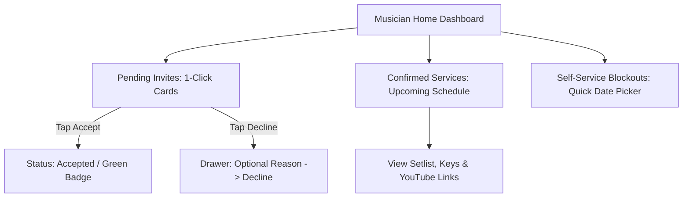

# Architecture, PL/SQL, SQL & Oracle APEX UI Patterns

All database objects in this system use the official project prefix: **`WS_`** (Worship Scheduling).

---

## 1. PL/SQL Architecture & Coding Standards

### 1.1 Layered Architecture & Separation of Concerns
The application follows a clean 3-tier database architecture:
1. **Data Layer (`WS_` Tables, Constraints, Triggers)**:
   - Primary data integrity enforced via declarative DDL (`NOT NULL`, `CHECK`, `FOREIGN KEY`, `UNIQUE`).
   - Sequences/Identity columns for primary keys (`PK_WS_...`).
2. **Business API Layer (PL/SQL Packages)**:
   - All complex business logic, transactional workflows, validations, and scheduling algorithms live in dedicated packages.
   - APEX pages **never** execute raw multi-table DML or complex transactional blocks directly in page processes; they call package APIs.
   - Core Packages:
     - `ws_pkg_scheduler`: Roster generation, auto-placement / randomizer, template slot instantiation.
     - `ws_pkg_service_mgmt`: Service lifecycle, setlist management, publication.
     - `ws_pkg_musician_portal`: Musician confirmation pipeline (`accept_invitation`, `decline_invitation`), blockout registration.
3. **Presentation Layer (Oracle APEX)**:
   - Views (`ws_v_...`), Interactive Reports, Cards, and Forms that bind to package APIs via bind variables (`:PXX_ITEM`, `:APP_USER`).

---

### 1.2 Naming & Prefix Conventions
Consistent prefixes must be used across all database objects and PL/SQL units:

#### Database Objects Prefix Standards
| Object Type | Prefix | Example | Notes |
| :--- | :--- | :--- | :--- |
| **Tables** | `ws_` / `WS_` | `WS_MEMBERS`, `WS_SERVICES`, `WS_SERVICE_ROSTER` | Plural or entity name |
| **Views** | `ws_v_` / `WS_V_` | `WS_V_ROSTER_CONFLICTS` | Analytical & APEX report views |
| **Packages** | `ws_pkg_` / `WS_PKG_` | `WS_PKG_SCHEDULER`, `WS_PKG_SERVICE_MGMT` | Core API boundary |
| **Packaged Procedures** | Namespace | `ws_pkg_scheduler.apply_template`, `ws_pkg_musician_portal.accept_invitation` | Qualified by package prefix |
| **Standalone Procedures**| `ws_prc_` / `WS_PRC_` | `WS_PRC_AUTO_ASSIGN_ROSTER` | Schema-level procedure wrapper |
| **Standalone Functions** | `ws_fn_` / `WS_FN_` | `WS_FN_IS_MUSICIAN_AVAILABLE` | Schema-level helper function |
| **Triggers** | `ws_trg_` / `WS_TRG_` | `WS_TRG_MEMBERS_BIU` | Table event trigger |
| **Sequences** | `ws_seq_` / `WS_SEQ_` | `WS_SEQ_MEMBERS` | Surrogate key sequence |
| **Primary Keys** | `pk_ws_` / `PK_WS_` | `PK_WS_MEMBERS`, `PK_WS_SERVICES` | Table PK constraint |
| **Foreign Keys** | `fk_ws_` / `FK_WS_` | `FK_WS_ROSTER_SERVICE`, `FK_WS_STS_TEMPLATE` | Referential integrity |
| **Unique Constraints** | `uq_ws_` / `UQ_WS_` | `UQ_WS_MEMBERS_USERNAME`, `UQ_WS_BANDS_NAME` | Uniqueness constraint |
| **Check Constraints** | `ck_ws_` / `CK_WS_` | `CK_WS_MEMBERS_ACTIVE`, `CK_WS_SONGS_KEY` | Value validation constraint |
| **Indexes** | `idx_ws_` / `IDX_WS_` | `IDX_WS_SERVICES_DATE`, `IDX_WS_SONGS_TITLE` | Performance index |

#### PL/SQL Code & Variable Conventions
| Identifier Type | Prefix | Example | Notes |
| :--- | :--- | :--- | :--- |
| **In Parameters** | `p_` | `p_service_id`, `p_member_id` | Read-only input |
| **Out Parameters** | `p_out_` or `x_` | `p_out_status`, `x_error_msg` | Output parameters |
| **In/Out Parameters** | `pio_` | `pio_record` | In-out parameter |
| **Local Variables** | `v_` | `v_service_date`, `v_count` | Local scope |
| **Constants** | `c_` | `c_status_pending CONSTANT VARCHAR2(10) := 'PENDING';` | Uppercase name |
| **Cursor / Record Loop** | `r_` | `FOR r_slot IN c_slots LOOP` | Explicit record naming |
| **Package Globals** | `g_` | `g_current_user` | Kept to minimum |
| **Types / Records** | `t_` | `t_candidate_rec`, `t_slot_tab` | User-defined types |

---

### 1.3 Concurrency, Locking & Transaction Boundaries
1. **Pessimistic Row Locking for Critical Paths**:
   - When running batch auto-scheduling or modifying an active roster, always lock the parent service row to prevent concurrent race conditions:
     ```sql
     SELECT service_date 
       INTO v_service_date 
       FROM ws_services 
      WHERE id = p_service_id 
        FOR UPDATE;
     ```
2. **Optimistic Locking for End-User Forms**:
   - In APEX forms (e.g. musician accepting an invite or leader modifying a slot), use `row_version_number` or APEX MD5 checksums.
   - If `row_version_number` does not match, raise a friendly error: *"This record was modified by another session. Please refresh."*
3. **Transaction Control**:
   - Helper procedures/functions **must not** contain `COMMIT` or `ROLLBACK` statements.
   - Commit occurs strictly at the APEX process boundary or top-level public API entry point.
   - Autonomous transactions (`PRAGMA AUTONOMOUS_TRANSACTION`) are **strictly reserved** for error logging and audit logging.

---

### 1.4 Error Handling & Instrumentation
1. **No Silent Failures**:
   - **Never** write empty `WHEN OTHERS THEN NULL;` exception blocks.
2. **Standard Exception Handling Pattern**:
   ```sql
   PROCEDURE process_roster_response (
       p_roster_id IN NUMBER,
       p_response  IN VARCHAR2,
       p_reason    IN VARCHAR2 DEFAULT NULL
   ) IS
       c_proc_name CONSTANT VARCHAR2(61) := 'ws_pkg_musician_portal.process_roster_response';
   BEGIN
       -- Input validation
       IF p_response NOT IN ('ACCEPTED', 'DECLINED') THEN
           apex_error.add_error(
               p_message          => 'Invalid confirmation response.',
               p_display_location => apex_error.c_inline_in_notification
           );
           RETURN;
       END IF;

       UPDATE ws_service_roster
          SET status = p_response,
              decline_reason = CASE WHEN p_response = 'DECLINED' THEN p_reason ELSE NULL END,
              confirmed_at = LOCALTIMESTAMP,
              row_version_number = row_version_number + 1
        WHERE id = p_roster_id;

   EXCEPTION
       WHEN OTHERS THEN
           -- Log error with call stack & backtrace
           apex_debug.error(
               p_message => 'Error in %s: %s | %s',
               p0        => c_proc_name,
               p1        => SQLERRM,
               p2        => DBMS_UTILITY.FORMAT_ERROR_BACKTRACE
           );
           RAISE;
   END process_roster_response;
   ```

---

## 2. SQL Standards & Guidelines

### 2.1 Formatting & Style
- **SQL Keywords**: UPPERCASE (`SELECT`, `INSERT`, `UPDATE`, `DELETE`, `FROM`, `WHERE`, `JOIN`, `ON`, `GROUP BY`, `ORDER BY`).
- **Database Identifiers**: lowercase with `ws_` prefix (`ws_services`, `service_date`, `member_id`, `status`).
- **Indentation & Clauses**: Each major clause starts on a new line; indented 2 or 4 spaces.
- **Explicit Joins**: Always use explicit ANSI JOIN syntax (`INNER JOIN`, `LEFT JOIN`). Comma-separated tables in `FROM` are forbidden.
- **Short Meaningful Aliases**:
  ```sql
  SELECT 
      s.id            AS service_id,
      s.service_date,
      sr.id           AS roster_id,
      i.name          AS instrument_name,
      m.full_name     AS musician_name,
      sr.status       AS confirmation_status
  FROM ws_services s
  JOIN ws_service_roster sr ON sr.service_id = s.id
  JOIN ws_instruments i     ON i.id = sr.instrument_id
  LEFT JOIN ws_members m    ON m.id = sr.member_id
  WHERE s.service_date >= TRUNC(SYSDATE)
  ORDER BY s.service_date ASC, i.display_order ASC;
  ```

---

### 2.2 Bind Variables & Security
- **Mandatory Bind Variables**: All queries embedded in PL/SQL or APEX regions must use bind variables (`:P1_SERVICE_ID`, `:APP_USER`).
- **SQL Injection Prevention**: Never concatenate user inputs into `EXECUTE IMMEDIATE` strings.
- **APEX Context Binding**: Always filter volunteer records against `:APP_USER` when serving self-service views:
  ```sql
  WHERE m.username = :APP_USER
  ```

---

### 2.3 Date & Time Precision
- Use `DATE` for calendar day entities (`service_date`, `start_date`, `end_date`).
- Comparisons against calendar days must eliminate time components:
  ```sql
  -- Preferred (Sargable with index on service_date):
  WHERE service_date >= TRUNC(SYSDATE) AND service_date < TRUNC(SYSDATE) + 7
  ```
- Use `TIMESTAMP WITH LOCAL TIME ZONE` for audit and confirmation timestamps (`confirmed_at`, `created_at`).

---

## 3. Oracle APEX UI / UX Patterns

### 3.1 Mobile-First Musician Portal (`/musician`)
Volunteers primarily interact with the system on smartphones.



1. **Card-Based Invitations**:
   - Use APEX **Cards Region** for pending invites from `ws_service_roster`.
   - Visual card attributes:
     - Header: Service Name & Date (Formatted: `DD-Mon-YYYY - Day of week`).
     - Subheader: Assigned Instrument / Role badge.
     - Actions: Prominent Primary **Accept** button (Green `u-success`) and Secondary **Decline** button (Red Outline `u-danger`).
2. **Decline Action via Drawer**:
   - Clicking "Decline" opens an APEX **Drawer Dialog** asking for an optional reason, keeping the volunteer in flow without navigating away.
3. **Setlist & YouTube Links**:
   - Assigned musicians see the setlist with songs from `ws_service_setlist` and `ws_songs`, service transposition keys, and a direct link/modal to play the YouTube reference.

---

### 3.2 Leader Scheduling Matrix & Management (`/leader`)
The leader dashboard is built for high-efficiency planning on tablet/desktop.

1. **Service Roster Matrix**:
   - Master-Detail or Interactive Grid displaying slots (Drums, Bass, Guitars, Keys, Vocals).
   - Real-time Status Badging:
     - `PENDING`: Yellow badge (`u-warning`).
     - `ACCEPTED`: Green badge (`u-success`).
     - `DECLINED`: Red badge (`u-danger`).
     - `CONFLICT`: Pulsating Red/Amber badge (`u-danger-text`) linked to `ws_v_roster_conflicts`.
2. **Action Toolbar**:
   - **"Auto-Fill (Randomizer)"**: Triggers `ws_pkg_scheduler.auto_assign_roster`. Shows success notification with count of slots filled.
   - **"Publish Schedule"**: Batches status from `DRAFT` to `PUBLISHED`, releasing invitations to musicians.
   - **"Instantiate Template"**: Select template (e.g. "Full Band", "Acoustic Night") and generate slots via `ws_pkg_scheduler.apply_template`.
3. **Musician Dropdown LOV Filtering**:
   - When manually picking a musician for a slot in the grid, the LOV query visually flags candidates:
     ```sql
     SELECT 
         m.full_name || 
         CASE 
             WHEN mb.id IS NOT NULL THEN ' ⚠️ [BLOCKED OUT: ' || mb.reason || ']'
             WHEN sr_today.id IS NOT NULL THEN ' ⚠️ [ALREADY PLAYING TODAY]'
             ELSE '  (Available)'
         END AS display_value,
         m.id AS return_value
     FROM ws_members m
     JOIN ws_member_instruments mi ON mi.member_id = m.id AND mi.instrument_id = :P20_INSTRUMENT_ID
     LEFT JOIN ws_member_blockouts mb 
            ON mb.member_id = m.id 
           AND :P20_SERVICE_DATE BETWEEN mb.start_date AND mb.end_date
     LEFT JOIN ws_service_roster sr_today
            ON sr_today.member_id = m.id
           AND sr_today.service_id = :P20_SERVICE_ID
     WHERE m.is_active = 'Y'
     ORDER BY mb.id NULLS FIRST, m.full_name ASC;
     ```

---

### 3.3 Universal Theme (UT) Styling & Standards
1. **Design System & Template Options**:
   - Standard Universal Theme 42.
   - Hero Region for Service Title and Summary Bar (Total Slots, Confirmed, Pending, Declined).
   - Use Theme Icons (`fa-music`, `fa-calendar-check-o`, `fa-youtube-play`, `fa-exclamation-triangle`).
2. **Dynamic Actions Guidelines**:
   - Use Dynamic Actions strictly for responsive client-side UI behaviors (e.g., toggling fields, refreshing report regions after modal close).
   - Never place core business rules or multi-step transactional DML inside client JavaScript Dynamic Actions.
3. **Notification & Feedback Messages**:
   - APEX inline notifications for form validations.
   - Floating success message after actions (e.g. *"Service published successfully! Invitations sent to 6 musicians."*).
