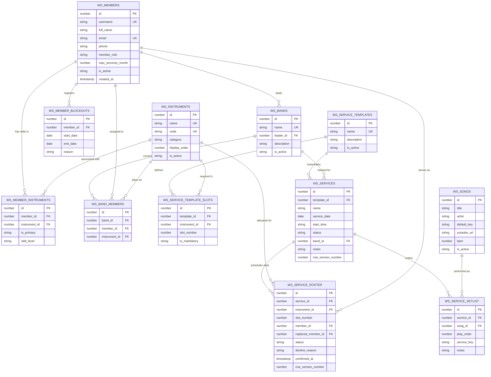

# Database Schema & Entity-Relationship Model (WorshipFlow)

All database objects in this system use the official project prefix: **`WS_`** (Worship Scheduling).

---

## 1. Entity-Relationship Diagram



---

## 2. Table Definitions & DDL Specifications

### 2.1 `WS_MEMBERS`
Stores user identity, APEX login account correlation, roles, and fatigue limits.

| Column | Type | Nullable | Default | Description / Constraints |
| :--- | :--- | :--- | :--- | :--- |
| `id` | `NUMBER` | NO | `IDENTITY` | Primary Key (`PK_WS_MEMBERS`) |
| `username` | `VARCHAR2(100)` | NO | - | Unique login matching Oracle APEX `:APP_USER` (`UQ_WS_MEMBERS_USERNAME`) |
| `full_name` | `VARCHAR2(150)` | NO | - | Display name of the musician or leader |
| `email` | `VARCHAR2(255)` | NO | - | Unique email for notifications (`UQ_WS_MEMBERS_EMAIL`) |
| `phone` | `VARCHAR2(50)` | YES | NULL | Contact mobile number |
| `member_role` | `VARCHAR2(30)` | NO | `'MUSICIAN'` | `CONSTRAINT CK_WS_MEMBERS_ROLE CHECK (member_role IN ('LEADER', 'MUSICIAN', 'ADMIN', 'TECH'))` |
| `max_services_month` | `NUMBER` | NO | `4` | Monthly service limit to prevent fatigue |
| `is_active` | `VARCHAR2(1)` | NO | `'Y'` | `CONSTRAINT CK_WS_MEMBERS_ACTIVE CHECK (is_active IN ('Y', 'N'))` |
| `created_at` | `TIMESTAMP WITH LOCAL TIME ZONE` | NO | `LOCALTIMESTAMP` | Record creation timestamp |
| `created_by` | `VARCHAR2(100)` | YES | NULL | Audit user |
| `updated_at` | `TIMESTAMP WITH LOCAL TIME ZONE` | YES | NULL | Audit timestamp |
| `updated_by` | `VARCHAR2(100)` | YES | NULL | Audit user |

---

### 2.2 `WS_INSTRUMENTS`
Lookup table defining musical instruments and ministry roles.

| Column | Type | Nullable | Default | Description / Constraints |
| :--- | :--- | :--- | :--- | :--- |
| `id` | `NUMBER` | NO | `IDENTITY` | Primary Key (`PK_WS_INSTRUMENTS`) |
| `name` | `VARCHAR2(100)` | NO | - | Display name (e.g., "Acoustic Guitar", "Lead Vocals") (`UQ_WS_INSTRUMENTS_NAME`) |
| `code` | `VARCHAR2(30)` | NO | - | Unique programmatic code (e.g., `'AC_GUITAR'`) (`UQ_WS_INSTRUMENTS_CODE`) |
| `category` | `VARCHAR2(30)` | NO | `'BAND'` | `CONSTRAINT CK_WS_INSTRUMENTS_CAT CHECK (category IN ('RHYTHM', 'MELODY', 'VOCALS', 'PRODUCTION'))` |
| `display_order` | `NUMBER` | NO | `0` | Order in matrix/roster headers |
| `is_active` | `VARCHAR2(1)` | NO | `'Y'` | `CONSTRAINT CK_WS_INSTRUMENTS_ACTIVE CHECK (is_active IN ('Y', 'N'))` |

---

### 2.3 `WS_MEMBER_INSTRUMENTS`
Associates musicians with the instruments/roles they can perform.

| Column | Type | Nullable | Default | Description / Constraints |
| :--- | :--- | :--- | :--- | :--- |
| `id` | `NUMBER` | NO | `IDENTITY` | Primary Key (`PK_WS_MEMBER_INSTRUMENTS`) |
| `member_id` | `NUMBER` | NO | - | FK to `WS_MEMBERS(id)` ON DELETE CASCADE |
| `instrument_id` | `NUMBER` | NO | - | FK to `WS_INSTRUMENTS(id)` ON DELETE CASCADE |
| `is_primary` | `VARCHAR2(1)` | NO | `'N'` | `CONSTRAINT CK_WS_MI_PRIMARY CHECK (is_primary IN ('Y', 'N'))` |
| `skill_level` | `VARCHAR2(20)` | NO | `'INTERMEDIATE'` | `CONSTRAINT CK_WS_MI_SKILL CHECK (skill_level IN ('BEGINNER', 'INTERMEDIATE', 'ADVANCED'))` |

- **Unique Constraint**: `CONSTRAINT UQ_WS_MEMBER_INSTRUMENTS UNIQUE (member_id, instrument_id)`

---

### 2.4 `WS_SERVICE_TEMPLATES` & `WS_SERVICE_TEMPLATE_SLOTS`
Reusable band templates (e.g., "Full 6-Piece Band", "Acoustic Trio") that generate required roster slots in 1 click.

```sql
CREATE TABLE ws_service_templates (
    id          NUMBER GENERATED ALWAYS AS IDENTITY CONSTRAINT pk_ws_service_templates PRIMARY KEY,
    name        VARCHAR2(100) NOT NULL CONSTRAINT uq_ws_service_templates_name UNIQUE,
    description VARCHAR2(500),
    is_active   VARCHAR2(1) DEFAULT 'Y' NOT NULL CONSTRAINT ck_ws_service_templates_active CHECK (is_active IN ('Y', 'N')),
    created_at  TIMESTAMP WITH LOCAL TIME ZONE DEFAULT LOCALTIMESTAMP NOT NULL
);

CREATE TABLE ws_service_template_slots (
    id            NUMBER GENERATED ALWAYS AS IDENTITY CONSTRAINT pk_ws_service_template_slots PRIMARY KEY,
    template_id   NUMBER NOT NULL CONSTRAINT fk_ws_sts_template REFERENCES ws_service_templates(id) ON DELETE CASCADE,
    instrument_id NUMBER NOT NULL CONSTRAINT fk_ws_sts_instrument REFERENCES ws_instruments(id) ON DELETE CASCADE,
    slot_number   NUMBER DEFAULT 1 NOT NULL,
    is_mandatory  VARCHAR2(1) DEFAULT 'Y' NOT NULL CONSTRAINT ck_ws_sts_mandatory CHECK (is_mandatory IN ('Y', 'N')),
    CONSTRAINT uq_ws_sts_slot UNIQUE (template_id, instrument_id, slot_number)
);
```

---

### 2.5 `WS_BANDS` & `WS_BAND_MEMBERS`
Pre-defined, named bands or worship teams.

| Column | Type | Nullable | Default | Description / Constraints |
| :--- | :--- | :--- | :--- | :--- |
| `id` | `NUMBER` | NO | `IDENTITY` | Primary Key (`PK_WS_BANDS`) |
| `name` | `VARCHAR2(100)` | NO | - | Unique band name (`UQ_WS_BANDS_NAME`) |
| `leader_id` | `NUMBER` | YES | NULL | FK to `WS_MEMBERS(id)` ON DELETE SET NULL |
| `description` | `VARCHAR2(500)` | YES | NULL | Optional notes or description |
| `is_active` | `VARCHAR2(1)` | NO | `'Y'` | `CONSTRAINT CK_WS_BANDS_ACTIVE CHECK (is_active IN ('Y', 'N'))` |
| `created_at` | `TIMESTAMP WITH LOCAL TIME ZONE` | NO | `LOCALTIMESTAMP` | Creation timestamp |

- `WS_BAND_MEMBERS` connects `band_id`, `member_id`, and `instrument_id` with `CONSTRAINT UQ_WS_BAND_MEMBERS UNIQUE (band_id, member_id, instrument_id)`.

---

### 2.6 `WS_MEMBER_BLOCKOUTS`
Dates when musicians are unavailable to serve.

| Column | Type | Nullable | Default | Description / Constraints |
| :--- | :--- | :--- | :--- | :--- |
| `id` | `NUMBER` | NO | `IDENTITY` | Primary Key (`PK_WS_MEMBER_BLOCKOUTS`) |
| `member_id` | `NUMBER` | NO | - | FK to `WS_MEMBERS(id)` ON DELETE CASCADE |
| `start_date` | `DATE` | NO | - | Start date of blockout |
| `end_date` | `DATE` | NO | - | End date of blockout |
| `reason` | `VARCHAR2(255)` | YES | NULL | Optional note (e.g., "Vacation", "Work shift") |
| `created_at` | `TIMESTAMP WITH LOCAL TIME ZONE` | NO | `LOCALTIMESTAMP` | Creation timestamp |

- **Check Constraint**: `CONSTRAINT CK_WS_BLOCKOUT_DATES CHECK (start_date <= end_date)`
- **Index**: `CREATE INDEX idx_ws_blockout_lookup ON ws_member_blockouts (member_id, start_date, end_date);`

---

### 2.7 `WS_SERVICES`
Worship events, services, or special rehearsals.

| Column | Type | Nullable | Default | Description / Constraints |
| :--- | :--- | :--- | :--- | :--- |
| `id` | `NUMBER` | NO | `IDENTITY` | Primary Key (`PK_WS_SERVICES`) |
| `template_id` | `NUMBER` | YES | NULL | FK to `WS_SERVICE_TEMPLATES(id)` ON DELETE SET NULL |
| `name` | `VARCHAR2(150)` | NO | - | e.g. "Sunday Morning Service", "Worship Night" |
| `service_date` | `DATE` | NO | - | Date of the service |
| `start_time` | `VARCHAR2(10)` | YES | `'10:00'` | 24-hr time representation (e.g., `'10:00'`) |
| `status` | `VARCHAR2(20)` | NO | `'DRAFT'` | `CONSTRAINT CK_WS_SERVICES_STATUS CHECK (status IN ('DRAFT', 'PUBLISHED', 'COMPLETED', 'CANCELLED'))` |
| `band_id` | `NUMBER` | YES | NULL | FK to `WS_BANDS(id)` (if assigned via pre-defined band) |
| `notes` | `VARCHAR2(1000)` | YES | NULL | General service briefing / leader notes |
| `row_version_number`| `NUMBER` | NO | `1` | Optimistic concurrency control |
| `created_at` | `TIMESTAMP WITH LOCAL TIME ZONE` | NO | `LOCALTIMESTAMP` | Audit timestamp |
| `created_by` | `VARCHAR2(100)` | YES | NULL | Audit user |
| `updated_at` | `TIMESTAMP WITH LOCAL TIME ZONE` | YES | NULL | Audit timestamp |
| `updated_by` | `VARCHAR2(100)` | YES | NULL | Audit user |

- **Index**: `CREATE INDEX idx_ws_services_date ON ws_services (service_date, status);`

---

### 2.8 `WS_SERVICE_ROSTER`
Band roster assignments per service slot. Supports bands, auto-placement, and manual pick.

| Column | Type | Nullable | Default | Description / Constraints |
| :--- | :--- | :--- | :--- | :--- |
| `id` | `NUMBER` | NO | `IDENTITY` | Primary Key (`PK_WS_SERVICE_ROSTER`) |
| `service_id` | `NUMBER` | NO | - | FK to `WS_SERVICES(id)` ON DELETE CASCADE |
| `instrument_id` | `NUMBER` | NO | - | FK to `WS_INSTRUMENTS(id)` |
| `slot_number` | `NUMBER` | NO | `1` | Differentiates multiple same-instrument slots |
| `member_id` | `NUMBER` | YES | NULL | FK to `WS_MEMBERS(id)` ON DELETE SET NULL |
| `replaced_member_id`| `NUMBER` | YES | NULL | FK to `WS_MEMBERS(id)` (audits who declined before replacement) |
| `status` | `VARCHAR2(20)` | NO | `'PENDING'` | `CONSTRAINT CK_WS_ROSTER_STATUS CHECK (status IN ('PENDING', 'ACCEPTED', 'DECLINED'))` |
| `decline_reason` | `VARCHAR2(255)` | YES | NULL | Reason left by musician if declined |
| `confirmed_at` | `TIMESTAMP WITH LOCAL TIME ZONE` | YES | NULL | When the musician accepted or declined |
| `row_version_number`| `NUMBER` | NO | `1` | Optimistic locking token |

- **Unique Constraint**: `CONSTRAINT UQ_WS_SERVICE_ROSTER UNIQUE (service_id, instrument_id, slot_number)`
- **Indexes**: 
  - `CREATE INDEX idx_ws_roster_member ON ws_service_roster (member_id, status);`
  - `CREATE INDEX idx_ws_roster_service ON ws_service_roster (service_id);`

---

### 2.9 `WS_SONGS`
Lean song repertoire catalog with standardized musical keys.

| Column | Type | Nullable | Default | Description / Constraints |
| :--- | :--- | :--- | :--- | :--- |
| `id` | `NUMBER` | NO | `IDENTITY` | Primary Key (`PK_WS_SONGS`) |
| `title` | `VARCHAR2(200)` | NO | - | Song Title |
| `artist` | `VARCHAR2(150)` | YES | NULL | Original artist / author |
| `default_key` | `VARCHAR2(10)` | NO | - | Key string (e.g. `'C'`, `'G'`, `'D'`, `'Em'`) |
| `youtube_url` | `VARCHAR2(1000)` | YES | NULL | YouTube link / reference video |
| `bpm` | `NUMBER` | YES | NULL | Beats per minute / tempo |
| `is_active` | `VARCHAR2(1)` | NO | `'Y'` | `CONSTRAINT CK_WS_SONGS_ACTIVE CHECK (is_active IN ('Y', 'N'))` |
| `created_at` | `TIMESTAMP WITH LOCAL TIME ZONE` | NO | `LOCALTIMESTAMP` | Creation timestamp |

- **Key Constraint**:
  ```sql
  CONSTRAINT ck_ws_songs_key CHECK (
      default_key IN (
          'C', 'C#', 'Db', 'D', 'D#', 'Eb', 'E', 'F', 'F#', 'Gb', 'G', 'G#', 'Ab', 'A', 'A#', 'Bb', 'B',
          'Cm', 'C#m', 'Dbm', 'Dm', 'D#m', 'Ebm', 'Em', 'Fm', 'F#m', 'Gbm', 'Gm', 'G#m', 'Abm', 'Am', 'A#m', 'Bbm', 'Bm'
      )
  )
  ```
- **Index**: `CREATE INDEX idx_ws_songs_title ON ws_songs (UPPER(title));`

---

### 2.10 `WS_SERVICE_SETLIST`
Songs selected for a service in planned execution order with service-specific keys.

| Column | Type | Nullable | Default | Description / Constraints |
| :--- | :--- | :--- | :--- | :--- |
| `id` | `NUMBER` | NO | `IDENTITY` | Primary Key (`PK_WS_SERVICE_SETLIST`) |
| `service_id` | `NUMBER` | NO | - | FK to `WS_SERVICES(id)` ON DELETE CASCADE |
| `song_id` | `NUMBER` | NO | - | FK to `WS_SONGS(id)` |
| `play_order` | `NUMBER` | NO | - | Sequence number (1, 2, 3...) |
| `service_key` | `VARCHAR2(10)` | NO | - | Key used for this specific service |
| `notes` | `VARCHAR2(500)` | YES | NULL | Arrangement or transition notes |

- **Unique Constraint**: `CONSTRAINT UQ_WS_SERVICE_SETLIST UNIQUE (service_id, play_order)`
- **Key Constraint**: Same standard musical key check as `WS_SONGS`.
- **Index**: `CREATE INDEX idx_ws_setlist_service ON ws_service_setlist (service_id, play_order);`

---

## 3. Concurrency Protection & Conflict Views

### 3.1 Retroactive Conflict Detection View (`WS_V_ROSTER_CONFLICTS`)
When a musician submits a blockout *after* having been scheduled, this view surfaces the conflict to the leader immediately:

```sql
CREATE OR REPLACE VIEW ws_v_roster_conflicts AS
SELECT 
    sr.id AS roster_id,
    sr.service_id,
    s.name AS service_name,
    s.service_date,
    m.id AS member_id,
    m.full_name AS member_name,
    i.name AS instrument_name,
    sr.status AS roster_status,
    mb.start_date AS blockout_start,
    mb.end_date AS blockout_end,
    mb.reason AS blockout_reason
FROM ws_service_roster sr
JOIN ws_services s ON s.id = sr.service_id
JOIN ws_members m ON m.id = sr.member_id
JOIN ws_instruments i ON i.id = sr.instrument_id
JOIN ws_member_blockouts mb ON mb.member_id = m.id
WHERE s.service_date BETWEEN mb.start_date AND mb.end_date
  AND sr.status IN ('PENDING', 'ACCEPTED')
  AND s.status IN ('DRAFT', 'PUBLISHED');
```

---

## 4. Robust Auto-Placement / Randomizer PL/SQL Implementation

Package: **`WS_PKG_SCHEDULER`**

```sql
CREATE OR REPLACE PACKAGE ws_pkg_scheduler AS
    PROCEDURE apply_template (
        p_service_id  IN NUMBER,
        p_template_id IN NUMBER
    );

    PROCEDURE auto_assign_roster (
        p_service_id IN NUMBER
    );
END ws_pkg_scheduler;
/

CREATE OR REPLACE PACKAGE BODY ws_pkg_scheduler AS

    PROCEDURE apply_template (
        p_service_id  IN NUMBER,
        p_template_id IN NUMBER
    ) IS
    BEGIN
        -- Populate empty slots from template
        INSERT INTO ws_service_roster (service_id, instrument_id, slot_number, status)
        SELECT p_service_id, sts.instrument_id, sts.slot_number, 'PENDING'
        FROM ws_service_template_slots sts
        WHERE sts.template_id = p_template_id
          AND NOT EXISTS (
              SELECT 1 FROM ws_service_roster sr
              WHERE sr.service_id = p_service_id
                AND sr.instrument_id = sts.instrument_id
                AND sr.slot_number = sts.slot_number
          );
    END apply_template;

    PROCEDURE auto_assign_roster (
        p_service_id IN NUMBER
    ) IS
        v_service_date DATE;
        v_selected_member_id NUMBER;
    BEGIN
        -- Lock service row to prevent concurrent schedule runs
        SELECT service_date
          INTO v_service_date
          FROM ws_services
         WHERE id = p_service_id
           FOR UPDATE;

        -- Iterate over unfilled slots
        FOR r_slot IN (
            SELECT id, instrument_id
              FROM ws_service_roster
             WHERE service_id = p_service_id
               AND (member_id IS NULL OR status = 'DECLINED')
             ORDER BY id
        ) LOOP
            v_selected_member_id := NULL;

            -- Find candidate: plays instrument, not blocked out,
            -- not already scheduled in ANY slot in THIS service,
            -- not already scheduled on this day, and below monthly cap.
            SELECT mi.member_id
              INTO v_selected_member_id
              FROM ws_member_instruments mi
              JOIN ws_members m ON m.id = mi.member_id
             WHERE mi.instrument_id = r_slot.instrument_id
               AND m.is_active = 'Y'
               -- 1. Not in a blockout on this service date
               AND NOT EXISTS (
                   SELECT 1 FROM ws_member_blockouts mb
                    WHERE mb.member_id = m.id
                      AND TRUNC(v_service_date) BETWEEN TRUNC(mb.start_date) AND TRUNC(mb.end_date)
               )
               -- 2. NOT already assigned to THIS service (prevents double-booking same musician)
               AND NOT EXISTS (
                   SELECT 1 FROM ws_service_roster sr_cur
                    WHERE sr_cur.service_id = p_service_id
                      AND sr_cur.member_id = m.id
               )
               -- 3. NOT already scheduled in another service on the same date
               AND NOT EXISTS (
                   SELECT 1 FROM ws_service_roster sr_other
                   JOIN ws_services s_other ON s_other.id = sr_other.service_id
                    WHERE sr_other.member_id = m.id
                      AND s_other.id != p_service_id
                      AND TRUNC(s_other.service_date) = TRUNC(v_service_date)
               )
               -- 4. Monthly fatigue cap
               AND (
                   SELECT COUNT(*)
                     FROM ws_service_roster sr_cnt
                     JOIN ws_services s_cnt ON s_cnt.id = sr_cnt.service_id
                    WHERE sr_cnt.member_id = m.id
                      AND TO_CHAR(s_cnt.service_date, 'YYYY-MM') = TO_CHAR(v_service_date, 'YYYY-MM')
                      AND sr_cnt.status IN ('PENDING', 'ACCEPTED')
               ) < m.max_services_month
             ORDER BY DBMS_RANDOM.VALUE
             FETCH FIRST 1 ROW ONLY;

            IF v_selected_member_id IS NOT NULL THEN
                UPDATE ws_service_roster
                   SET member_id = v_selected_member_id,
                       status = 'PENDING',
                       decline_reason = NULL,
                       row_version_number = row_version_number + 1
                 WHERE id = r_slot.id;
            END IF;

        EXCEPTION
            WHEN NO_DATA_FOUND THEN
                -- Leave slot empty if no eligible candidate found
                NULL;
        END LOOP;
    END auto_assign_roster;

END ws_pkg_scheduler;
/

-- 4.1 Standalone Procedure Wrappers (Schema-Level Entry Points)
CREATE OR REPLACE PROCEDURE ws_prc_apply_template (
    p_service_id  IN NUMBER,
    p_template_id IN NUMBER
) AS
BEGIN
    ws_pkg_scheduler.apply_template(
        p_service_id  => p_service_id,
        p_template_id => p_template_id
    );
END ws_prc_apply_template;
/

CREATE OR REPLACE PROCEDURE ws_prc_auto_assign_roster (
    p_service_id IN NUMBER
) AS
BEGIN
    ws_pkg_scheduler.auto_assign_roster(
        p_service_id => p_service_id
    );
END ws_prc_auto_assign_roster;
/
```
