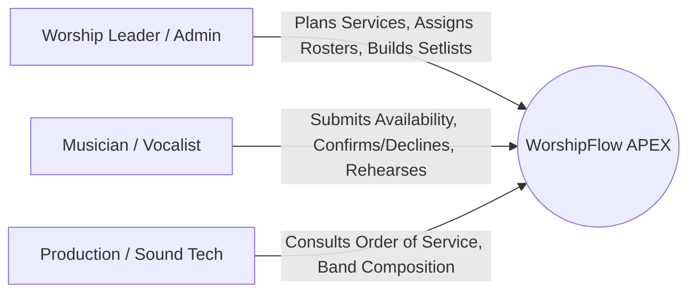
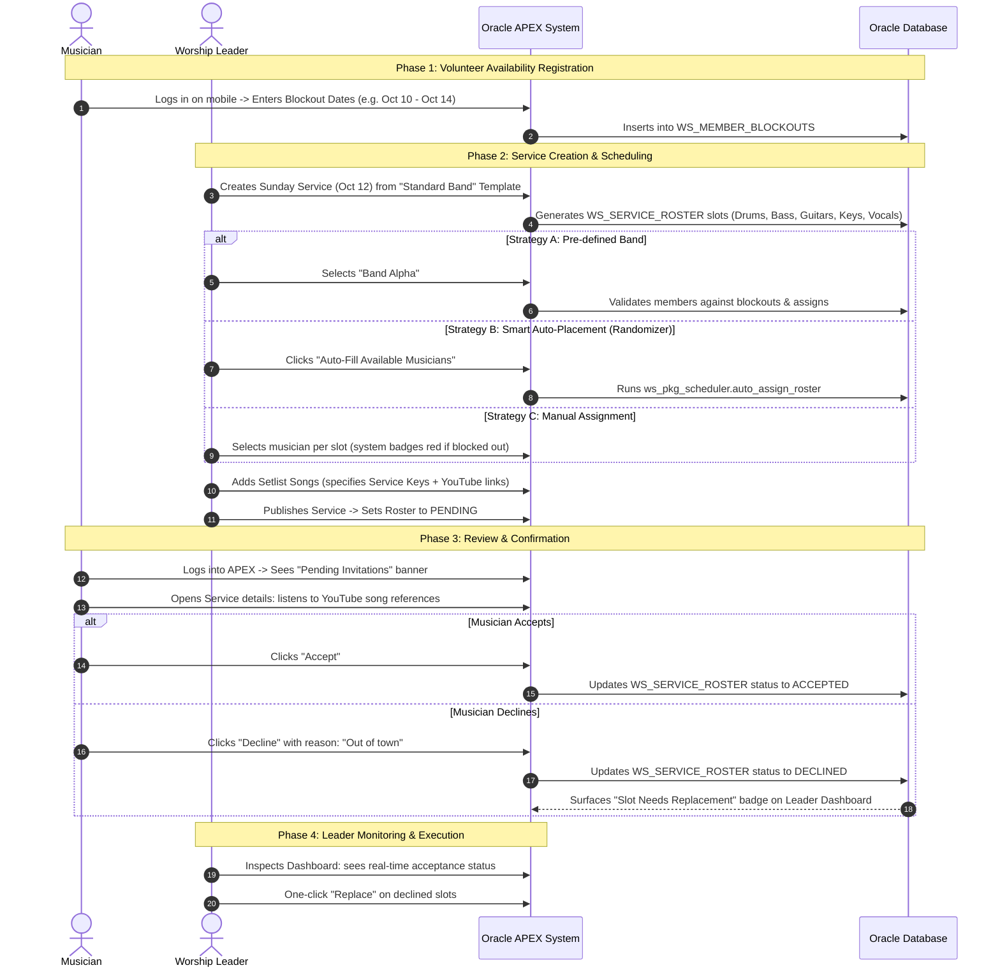

# Worship Scheduling & Musician Availability System (WorshipFlow)
## Comprehensive Functional & Technical Specification

All database objects in this system use the official project prefix: **`WS_`** (Worship Scheduling).

---

## 1. Problem Statement & Domain Context

In local churches and ministry teams, coordinating worship bands is often one of the most recurring, friction-heavy administrative tasks for Worship Leaders. 

### Core Dilemma
- **Leaders** spend hours every month cross-referencing who is in town, who plays which instrument, who sang last week, and chasing confirmations via chat apps.
- **Musicians & Singers** are volunteers with fluctuating personal schedules, shifting work shifts, vacations, and family obligations who get caught in last-minute or duplicate bookings.
- **Song & Rehearsal Disconnect**: Even after scheduling, sharing song keys, chord sheets, and audio links is separated from the roster, leading to unprepared teams.

---

## 2. In-Depth Competitive Analysis & Benchmark Matrix

| Feature / Dimension | **Planning Center Services (PCO)** | **Elvanto / Breeze ChMS** | **Manual (WhatsApp + Sheets)** | **WorshipFlow (Our APEX System)** |
| :--- | :--- | :--- | :--- | :--- |
| **Pricing & Accessibility** | Expensive per-member tiers ($19 to $199+/mo). High lock-in. | Bundled in full church suite; costly for just worship. | Free, but high cost in lost volunteer time & confusion. | **Zero software licensing cost** (runs on Oracle APEX / Free Tier or internal DB). |
| **Service Templates** | Excellent (Matrix with reusable position templates). | Good (basic team positions). | None (Copy-pasting spreadsheet rows). | **Native Templates** (`WS_SERVICE_TEMPLATES` to populate required slots in 1 click). |
| **Availability / Blockouts** | Gold standard (Calendar blockout, recurring rules). | Basic calendar blockout. | Google Form or WhatsApp messages (static, prone to errors). | **Self-Service Blockouts** (`WS_MEMBER_BLOCKOUTS`) with automatic conflict warnings during scheduling. |
| **Roster Generation** | Manual matrix or template-based; lacks intelligent auto-shuffle. | Manual assignment per slot. | 100% manual trial and error. | **Hybrid**: Pre-defined **Bands** (`WS_BANDS`), Manual Grid, OR **Smart Auto-Placement (Randomizer)**. |
| **Volunteer Fatigue Guard** | Soft alert on scheduling matrix. | Weak / not integrated. | Non-existent; leaders over-schedule reliable favorites. | **Hard & Soft Frequency Caps** (e.g. `max_services_month` enforced in queries). |
| **Retroactive Blockouts** | Flags an orange warning if musician blocks out after being scheduled. | Often ignored or buried in notifications. | Invisible unless volunteer remembers to chat. | **Automatic Retroactive Detection View** (`WS_V_ROSTER_CONFLICTS`) flagging schedule clashes. |
| **Musician Experience** | Native mobile app with separate credentials. | Web portal with cluttered ChMS menu. | Chat notifications, spreadsheet links. | **Responsive APEX Mobile UI**: 1-click Accept/Decline, Setlist with YouTube links. |
| **Song Integration** | Deep (transposition, attachments, CCLI integration). | Basic file attachment. | PDF links in Google Drive / WhatsApp. | **Lean & Fast**: Title, Artist, Default Key, YouTube URL, plus per-service key (`WS_SERVICE_SETLIST`). |

---

## 3. Key Personas & Role Matrix

1. **Worship Leader / Music Director (Role: `LEADER` / `ADMIN`)**:
   - Manages service templates (e.g., "Sunday Morning 5-Piece Band", "Acoustic Night").
   - Creates services and populates rosters via:
     - Pre-defined Band assignment (e.g., `WS_BANDS`).
     - Auto-placement / Randomizer (`ws_pkg_scheduler.auto_assign_roster`).
     - Manual selection with real-time conflict indicators.
   - Builds setlists with target service keys and YouTube rehearsal links.
   - Monitors confirmations and resolves declines or retroactive conflicts.

2. **Musician / Vocalist (Role: `MUSICIAN`)**:
   - Primary mobile user logging directly into Oracle APEX.
   - Manages personal profile (skills, primary instrument in `WS_MEMBER_INSTRUMENTS`).
   - Registers blockout date ranges (`WS_MEMBER_BLOCKOUTS`).
   - Receives service invitations: reviews songs, keys, YouTube links, and clicks **Accept** or **Decline** (with reason).

3. **Production / Sound Technician (Role: `TECH` / `VIEWER`)**:
   - Read-only dashboard access to know stage layout, vocalists, and order of service.

---

## 4. End-to-End Operational Lifecycle

---

## 5. Concurrency Analysis, Edge Cases & Resolution Strategies

### 5.1 Edge Case 1: Retroactive Blockout Conflict
* **Scenario**: Leader schedules Musician Dave for Sunday Oct 20. Two days later, Dave realizes he has a family trip and adds an Oct 20 blockout.
* **Resolution**:
  - The database view `WS_V_ROSTER_CONFLICTS` detects any active (`PENDING` or `ACCEPTED`) `WS_SERVICE_ROSTER` entry overlapping `WS_MEMBER_BLOCKOUTS`.
  - The Leader's dashboard immediately highlights the slot with an orange **"Conflict Detected"** alert and provides a 1-click **"Find Replacement"** action.

### 5.2 Edge Case 2: Double-Booking in the Same Service
* **Scenario**: A volunteer plays both Acoustic Guitar and Drums. The auto-placement randomizer or a manual scheduler tries to book them for both instruments in the same service.
* **Resolution**:
  - The Auto-Placement engine `ws_pkg_scheduler.auto_assign_roster` dynamically excludes already-selected musicians within the active `service_id`.

### 5.3 Edge Case 3: Race Condition during Concurrent Auto-Placement
* **Scenario**: Two leaders schedule simultaneous services (e.g. 9:00 AM Service and 11:00 AM Service) at the exact same moment and both run the auto-randomizer.
* **Resolution**:
  - The PL/SQL scheduling package uses row-level locking (`SELECT ... FOR UPDATE`) on `WS_SERVICES` so that musicians assigned in transaction A are excluded from transaction B.

### 5.4 Edge Case 4: Stale State on Musician Confirmation (Optimistic Locking)
* **Scenario**: A musician leaves the page open for 30 minutes. In the meantime, the leader cancelled the slot or assigned someone else. The musician clicks "Accept".
* **Resolution**:
  - `row_version_number` verification on `WS_SERVICE_ROSTER`. If the record changed, the user receives an alert: *"This invitation is no longer active."*

---

## 6. Functional Module Breakdown

### 6.1 Administration & Configuration
- **Member Directory (`WS_MEMBERS`)**: Manage musicians, roles, contact information, APEX `:APP_USER` mapping, and monthly service caps (`max_services_month`).
- **Instruments / Roles (`WS_INSTRUMENTS`)**: Define instrument types, codes, display order, and stage categories (Rhythm, Melody, Vocals, Production).
- **Service Templates (`WS_SERVICE_TEMPLATES`, `WS_SERVICE_TEMPLATE_SLOTS`)**:
  - Template Name (e.g., "Full Band", "Acoustic Duo").
  - Template Slots: Defined set of required instruments (e.g., 1 Drums, 1 Bass, 1 Ac Guitar, 1 Elec Guitar, 1 Keys, 2 Vocals).

### 6.2 Availability & Blockouts
- **Volunteer Self-Service (`WS_MEMBER_BLOCKOUTS`)**: Mobile-optimized calendar and date-range submission.
- **Leader Availability Heatmap**: Visual grid showing who is available vs. blocked out for any chosen month.

### 6.3 Scheduling & Roster Management
- **Service Creation (`WS_SERVICES`)**: Create a service manually or instantiate from a `WS_SERVICE_TEMPLATES`.
- **Roster Assignment Engine (`WS_SERVICE_ROSTER`)**:
  1. *Assign Pre-defined Band (`WS_BANDS`)*: Fills slots based on `WS_BAND_MEMBERS`, verifying no member is blocked out.
  2. *Auto-Placement (Randomizer)*: Algorithmically populates empty slots by selecting available candidates weighted by serving frequency.
  3. *Manual Grid Picker*: Quick dropdown showing only eligible musicians with green badges (available) and red badges (blocked out/busy).
- **Publication Lifecycle**: Draft mode (invisible to musicians) $\rightarrow$ Published mode (triggers mobile invitations).

### 6.4 Song Library & Service Setlists
- **Repertoire Catalog (`WS_SONGS`)**: Title, Artist, Default Key, Tempo (BPM), and YouTube URL.
- **Service Setlist Builder (`WS_SERVICE_SETLIST`)**:
  - Add songs, drag-and-drop or sequence play order.
  - Set the **Service Key** (transposed key for the service).
  - YouTube player link available directly on both leader and musician screens.

### 6.5 Musician Mobile Portal
- **Dashboard**:
  - **Action Required**: Pending invitations with 1-click Accept / Decline.
  - **My Upcoming Services**: Calendar of confirmed services with band roster and setlist.
  - **Quick Blockout**: Form to quickly mark upcoming vacation days.
